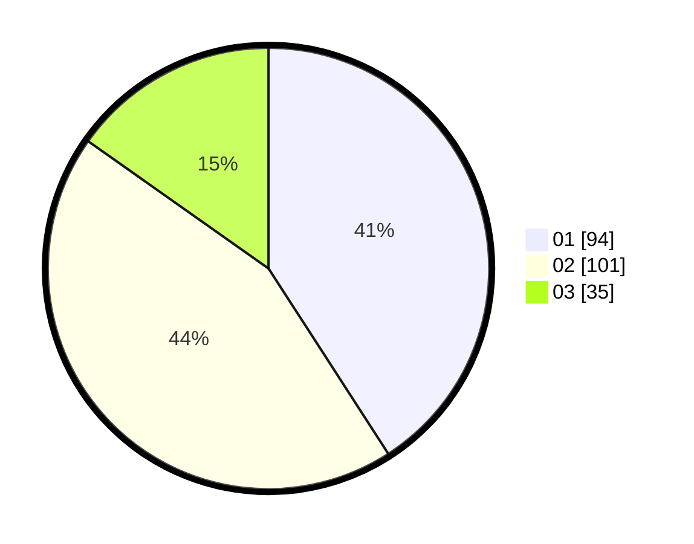

# Hasil

Hasil perolehan suara paslon dapat dilihat pada file paslon-01.txt, paslon-02.txt, dan paslon-03.txt.

Jika tidak ada, artinya data tersebut belum ada pada SIREKAP.

## Perolehan Suara

 * Paslon 01: **94**.
 * Paslon 02: **101**.
 * Paslon 03: **35**.

## Foto C Plano

https://sirekap-obj-formc.kpu.go.id/a45c/pemilu/ppwp/31/75/08/10/01/3175081001027-20240214-235213--3922b214-a2e2-4f73-96b0-b82f15499612.jpg

https://sirekap-obj-formc.kpu.go.id/a45c/pemilu/ppwp/31/75/08/10/01/3175081001027-20240214-235447--ccbf8b7b-568b-4b55-a932-a039be93b92b.jpg

https://sirekap-obj-formc.kpu.go.id/a45c/pemilu/ppwp/31/75/08/10/01/3175081001027-20240214-235702--7d7ae5d4-c6b9-4a77-8704-f66b59d43020.jpg
