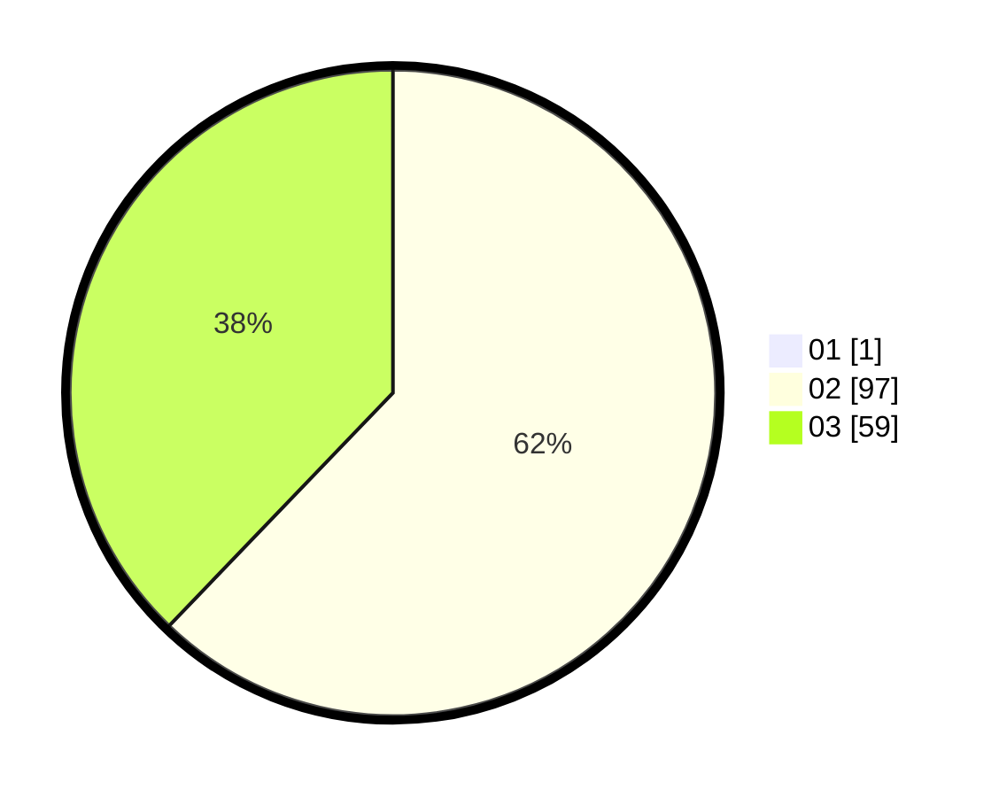

# Hasil

Hasil perolehan suara paslon dapat dilihat pada file paslon-01.txt, paslon-02.txt, dan paslon-03.txt.

Jika tidak ada, artinya data tersebut belum ada pada SIREKAP.

## Perolehan Suara

 * Paslon 01: **1**.
 * Paslon 02: **97**.
 * Paslon 03: **59**.

## Foto C Plano

https://sirekap-obj-formc.kpu.go.id/244f/pemilu/ppwp/31/75/08/10/01/3175081001033-20240214-200402--3a139aae-9001-4f5c-95e5-959a0715cfe8.jpg

https://sirekap-obj-formc.kpu.go.id/244f/pemilu/ppwp/31/75/08/10/01/3175081001033-20240214-193935--b2047167-1306-4e13-8c50-cf98f1f442be.jpg

https://sirekap-obj-formc.kpu.go.id/244f/pemilu/ppwp/31/75/08/10/01/3175081001033-20240214-194011--ddbee81e-1d06-441e-9247-ae8e9ce25d82.jpg
