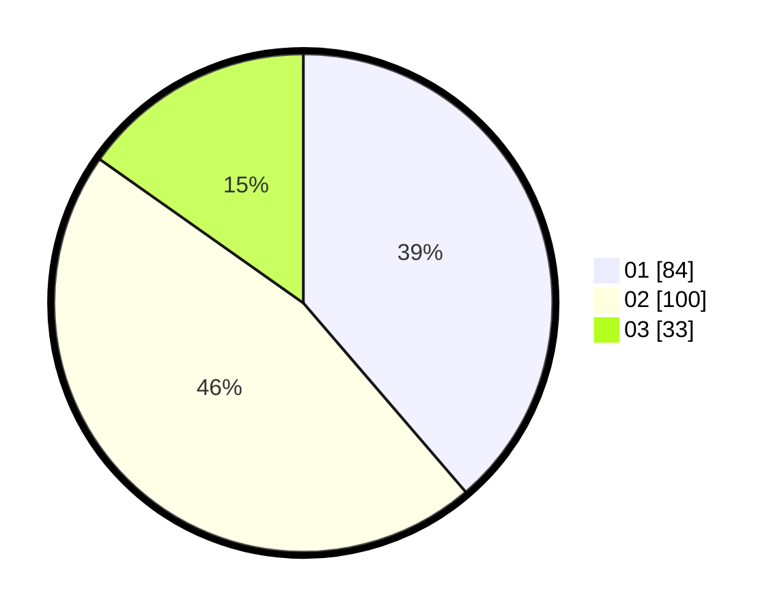

# Hasil

Hasil perolehan suara paslon dapat dilihat pada file paslon-01.txt, paslon-02.txt, dan paslon-03.txt.

Jika tidak ada, artinya data tersebut belum ada pada SIREKAP.

## Perolehan Suara

 * Paslon 01: **84**.
 * Paslon 02: **100**.
 * Paslon 03: **33**.

## Foto C Plano

https://sirekap-obj-formc.kpu.go.id/ec16/pemilu/ppwp/31/75/08/10/01/3175081001037-20240214-191050--d747be9c-f63c-43f2-956b-938091e4108f.jpg

https://sirekap-obj-formc.kpu.go.id/ec16/pemilu/ppwp/31/75/08/10/01/3175081001037-20240214-195901--35ef633c-c58f-4b53-96c0-89bff966a173.jpg

https://sirekap-obj-formc.kpu.go.id/ec16/pemilu/ppwp/31/75/08/10/01/3175081001037-20240214-191234--0e6ecde7-5bbd-4ff0-acf2-942311a05285.jpg

## DATA PEMILIH TETAP

Jumlah pemilih dalam DPT: **280**.
 * L: **145**.
 * P: **135**.

## DATA PENGGUNA HAK PILIH

Jumlah pengguna hak pilih dalam DPT: **225**.
 * L: **113**.
 * P: **112**.

Jumlah pengguna hak pilih dalam DPTb: **0**.
 * L: **0**.
 * P: **0**.

Jumlah pengguna hak pilih dalam DPK: **0**.
 * L: **0**.
 * P: **0**.

Jumlah pengguna hak pilih: **225**.
 * L: **113**.
 * P: **112**.

## JUMLAH SUARA SAH DAN TIDAK SAH

JUMLAH SELURUH SUARA SAH: **217**.

JUMLAH SUARA TIDAK SAH: **8**.

JUMLAH SELURUH SUARA SAH DAN SUARA TIDAK SAH: **225**.
