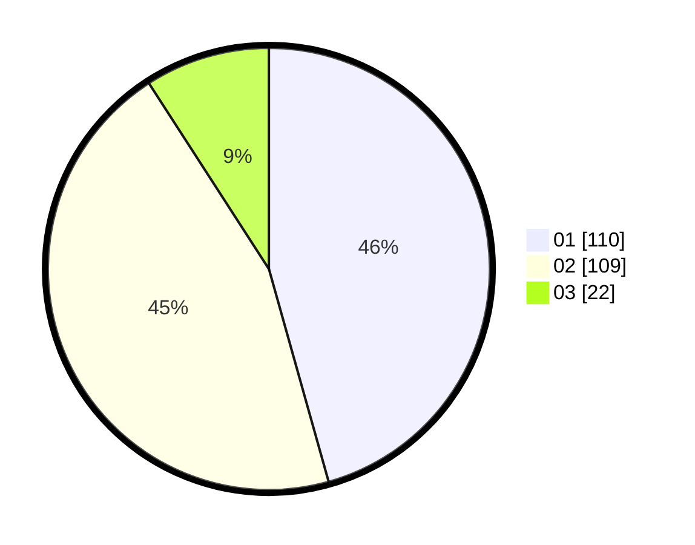

# Hasil

Hasil perolehan suara paslon dapat dilihat pada file paslon-01.txt, paslon-02.txt, dan paslon-03.txt.

Jika tidak ada, artinya data tersebut belum ada pada SIREKAP.

## Perolehan Suara

 * Paslon 01: **110**.
 * Paslon 02: **109**.
 * Paslon 03: **22**.

## Foto C Plano

https://sirekap-obj-formc.kpu.go.id/cf8c/pemilu/ppwp/31/75/08/10/01/3175081001038-20240215-205437--28c9c0d6-5518-425e-aa28-702f396931a9.jpg

https://sirekap-obj-formc.kpu.go.id/cf8c/pemilu/ppwp/31/75/08/10/01/3175081001038-20240215-205440--82a91c00-1a73-42f9-833c-ad63019f731f.jpg

https://sirekap-obj-formc.kpu.go.id/cf8c/pemilu/ppwp/31/75/08/10/01/3175081001038-20240215-205439--70787d33-3c98-4f3a-aba1-36732056925e.jpg

## DATA PEMILIH TETAP

Jumlah pemilih dalam DPT: **286**.
 * L: **136**.
 * P: **150**.

## DATA PENGGUNA HAK PILIH

Jumlah pengguna hak pilih dalam DPT: **240**.
 * L: **105**.
 * P: **135**.

Jumlah pengguna hak pilih dalam DPTb: **0**.
 * L: **0**.
 * P: **0**.

Jumlah pengguna hak pilih dalam DPK: **2**.
 * L: **0**.
 * P: **2**.

Jumlah pengguna hak pilih: **242**.
 * L: **105**.
 * P: **137**.

## JUMLAH SUARA SAH DAN TIDAK SAH

JUMLAH SELURUH SUARA SAH: **241**.

JUMLAH SUARA TIDAK SAH: **1**.

JUMLAH SELURUH SUARA SAH DAN SUARA TIDAK SAH: **242**.
