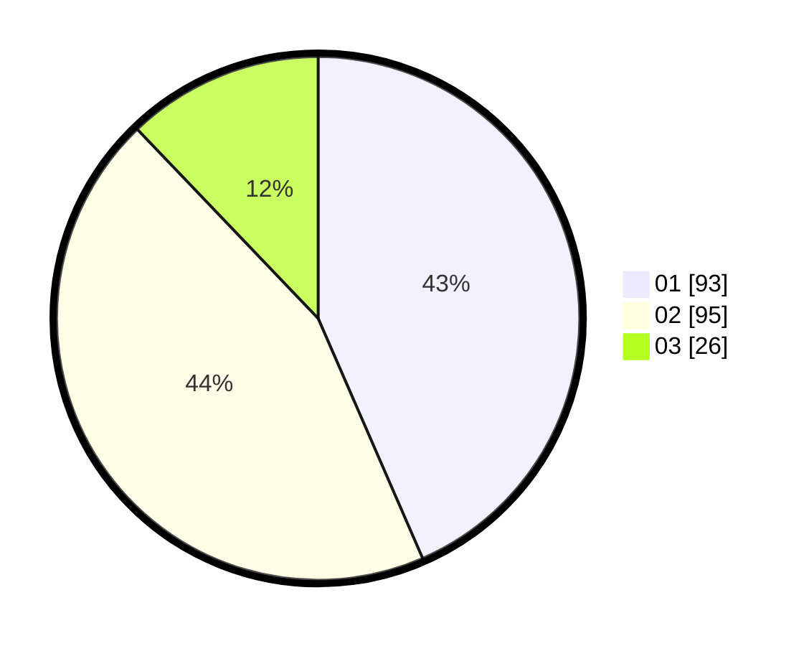

# Hasil

Hasil perolehan suara paslon dapat dilihat pada file paslon-01.txt, paslon-02.txt, dan paslon-03.txt.

Jika tidak ada, artinya data tersebut belum ada pada SIREKAP.

## Perolehan Suara

 * Paslon 01: **93**.
 * Paslon 02: **95**.
 * Paslon 03: **26**.

## Foto C Plano

https://sirekap-obj-formc.kpu.go.id/d3d0/pemilu/ppwp/31/75/08/10/01/3175081001041-20240214-194616--347af89f-92bb-46f3-b21f-09a5c418f72c.jpg

https://sirekap-obj-formc.kpu.go.id/d3d0/pemilu/ppwp/31/75/08/10/01/3175081001041-20240214-205246--2a231056-66e5-48c7-a421-74223fb34fd8.jpg

https://sirekap-obj-formc.kpu.go.id/d3d0/pemilu/ppwp/31/75/08/10/01/3175081001041-20240214-205423--1c5092c3-34d0-4d4c-9c8e-e50f71cdc5a7.jpg

## DATA PEMILIH TETAP

Jumlah pemilih dalam DPT: **263**.
 * L: **125**.
 * P: **138**.

## DATA PENGGUNA HAK PILIH

Jumlah pengguna hak pilih dalam DPT: **216**.
 * L: **100**.
 * P: **116**.

Jumlah pengguna hak pilih dalam DPTb: **0**.
 * L: **0**.
 * P: **0**.

Jumlah pengguna hak pilih dalam DPK: **2**.
 * L: **1**.
 * P: **1**.

Jumlah pengguna hak pilih: **218**.
 * L: **101**.
 * P: **117**.

## JUMLAH SUARA SAH DAN TIDAK SAH

JUMLAH SELURUH SUARA SAH: **214**.

JUMLAH SUARA TIDAK SAH: **4**.

JUMLAH SELURUH SUARA SAH DAN SUARA TIDAK SAH: **218**.
