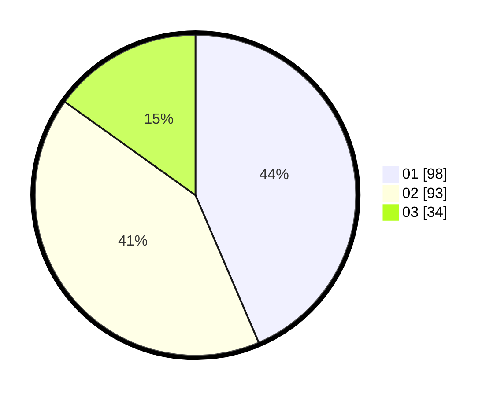

# Hasil

Hasil perolehan suara paslon dapat dilihat pada file paslon-01.txt, paslon-02.txt, dan paslon-03.txt.

Jika tidak ada, artinya data tersebut belum ada pada SIREKAP.

## Perolehan Suara

 * Paslon 01: **98**.
 * Paslon 02: **93**.
 * Paslon 03: **34**.

## Foto C Plano

https://sirekap-obj-formc.kpu.go.id/1f65/pemilu/ppwp/31/75/08/10/01/3175081001042-20240214-190541--d9c8b0f1-325a-4832-aed0-6a821e962661.jpg

https://sirekap-obj-formc.kpu.go.id/1f65/pemilu/ppwp/31/75/08/10/01/3175081001042-20240214-193314--45a1a8b1-c61f-49df-8bf8-5ebb9f3b5771.jpg

https://sirekap-obj-formc.kpu.go.id/1f65/pemilu/ppwp/31/75/08/10/01/3175081001042-20240214-193402--225c20c5-40ca-48d6-b723-ec421e25bdde.jpg

## DATA PEMILIH TETAP

Jumlah pemilih dalam DPT: **263**.
 * L: **120**.
 * P: **143**.

## DATA PENGGUNA HAK PILIH

Jumlah pengguna hak pilih dalam DPT: **226**.
 * L: **101**.
 * P: **125**.

Jumlah pengguna hak pilih dalam DPTb: **0**.
 * L: **0**.
 * P: **0**.

Jumlah pengguna hak pilih dalam DPK: **2**.
 * L: **1**.
 * P: **1**.

Jumlah pengguna hak pilih: **228**.
 * L: **102**.
 * P: **126**.

## JUMLAH SUARA SAH DAN TIDAK SAH

JUMLAH SELURUH SUARA SAH: **225**.

JUMLAH SUARA TIDAK SAH: **3**.

JUMLAH SELURUH SUARA SAH DAN SUARA TIDAK SAH: **228**.
