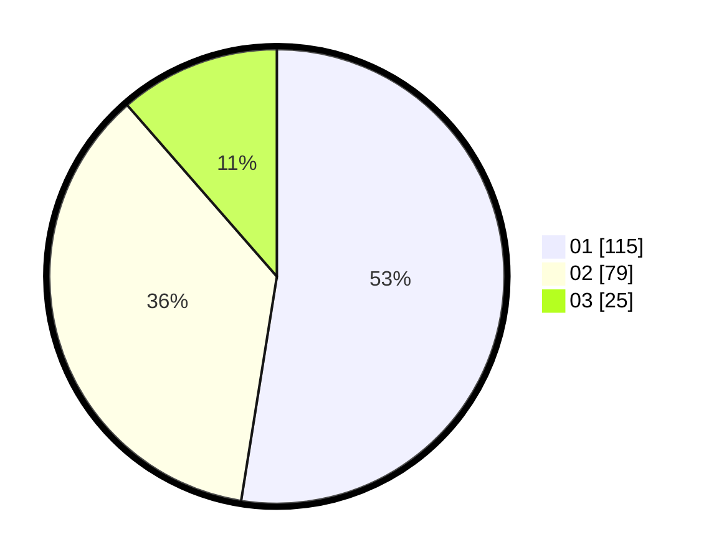

# Hasil

Hasil perolehan suara paslon dapat dilihat pada file paslon-01.txt, paslon-02.txt, dan paslon-03.txt.

Jika tidak ada, artinya data tersebut belum ada pada SIREKAP.

## Perolehan Suara

 * Paslon 01: **115**.
 * Paslon 02: **79**.
 * Paslon 03: **25**.

## Foto C Plano

https://sirekap-obj-formc.kpu.go.id/cdc4/pemilu/ppwp/31/75/08/10/01/3175081001044-20240216-094928--fe381dbd-2522-4a86-ba19-ed72dbe7a626.jpg

https://sirekap-obj-formc.kpu.go.id/cdc4/pemilu/ppwp/31/75/08/10/01/3175081001044-20240216-094957--074b47fc-d709-4cf0-bbc6-12379e55fbeb.jpg
