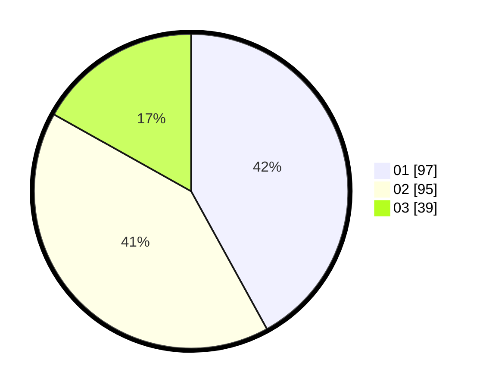

# Hasil

Hasil perolehan suara paslon dapat dilihat pada file paslon-01.txt, paslon-02.txt, dan paslon-03.txt.

Jika tidak ada, artinya data tersebut belum ada pada SIREKAP.

## Perolehan Suara

 * Paslon 01: **97**.
 * Paslon 02: **95**.
 * Paslon 03: **39**.

## Foto C Plano

https://sirekap-obj-formc.kpu.go.id/771b/pemilu/ppwp/31/75/08/10/01/3175081001047-20240215-014339--3c185fb9-2e25-44c2-bbed-6e546190ffa3.jpg

https://sirekap-obj-formc.kpu.go.id/771b/pemilu/ppwp/31/75/08/10/01/3175081001047-20240215-014349--ed1ab114-fa26-4e6b-9cdc-6e6389806684.jpg

https://sirekap-obj-formc.kpu.go.id/771b/pemilu/ppwp/31/75/08/10/01/3175081001047-20240215-014354--cd7e8fb8-5388-4039-a2a6-e7f238a801ee.jpg
