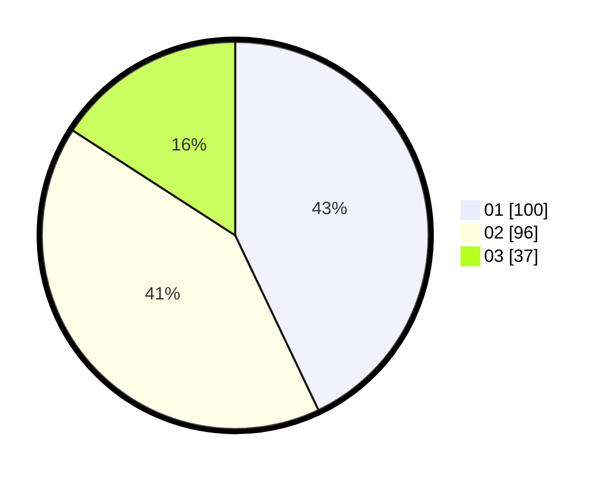

# Hasil

Hasil perolehan suara paslon dapat dilihat pada file paslon-01.txt, paslon-02.txt, dan paslon-03.txt.

Jika tidak ada, artinya data tersebut belum ada pada SIREKAP.

## Perolehan Suara

 * Paslon 01: **100**.
 * Paslon 02: **96**.
 * Paslon 03: **37**.

## Foto C Plano

https://sirekap-obj-formc.kpu.go.id/6e89/pemilu/ppwp/31/75/08/10/01/3175081001049-20240214-235505--03d9ae35-bf50-4528-94ad-95089c716b87.jpg

https://sirekap-obj-formc.kpu.go.id/6e89/pemilu/ppwp/31/75/08/10/01/3175081001049-20240214-231954--e58824d7-1fdb-43c1-bf37-1f1bee4f2e81.jpg

https://sirekap-obj-formc.kpu.go.id/6e89/pemilu/ppwp/31/75/08/10/01/3175081001049-20240214-232157--7ff8a401-85b7-4a40-a9ca-8aea2d97a7ba.jpg
