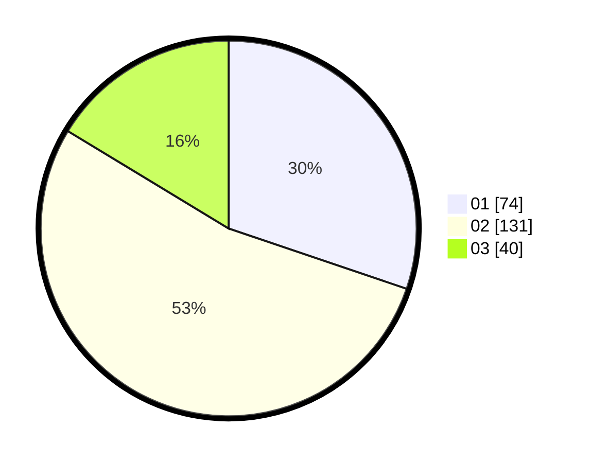

# Hasil

Hasil perolehan suara paslon dapat dilihat pada file paslon-01.txt, paslon-02.txt, dan paslon-03.txt.

Jika tidak ada, artinya data tersebut belum ada pada SIREKAP.

## Perolehan Suara

 * Paslon 01: **74**.
 * Paslon 02: **131**.
 * Paslon 03: **40**.

## Foto C Plano

https://sirekap-obj-formc.kpu.go.id/e295/pemilu/ppwp/31/75/08/10/01/3175081001055-20240216-230818--f9d86b6a-9ead-4495-ae10-436f6cd18b42.jpg

https://sirekap-obj-formc.kpu.go.id/e295/pemilu/ppwp/31/75/08/10/01/3175081001055-20240216-230819--9e5c8a58-e567-4740-9a2b-f9271925cf12.jpg

https://sirekap-obj-formc.kpu.go.id/e295/pemilu/ppwp/31/75/08/10/01/3175081001055-20240216-230819--aef2ab7c-52be-447a-b14c-193914ffee06.jpg

## DATA PEMILIH TETAP

Jumlah pemilih dalam DPT: **282**.
 * L: **125**.
 * P: **157**.

## DATA PENGGUNA HAK PILIH

Jumlah pengguna hak pilih dalam DPT: **245**.
 * L: **103**.
 * P: **142**.

Jumlah pengguna hak pilih dalam DPTb: **0**.
 * L: **0**.
 * P: **0**.

Jumlah pengguna hak pilih dalam DPK: **0**.
 * L: **0**.
 * P: **0**.

Jumlah pengguna hak pilih: **245**.
 * L: **103**.
 * P: **142**.

## JUMLAH SUARA SAH DAN TIDAK SAH

JUMLAH SELURUH SUARA SAH: **245**.

JUMLAH SUARA TIDAK SAH: **1**.

JUMLAH SELURUH SUARA SAH DAN SUARA TIDAK SAH: **246**.
