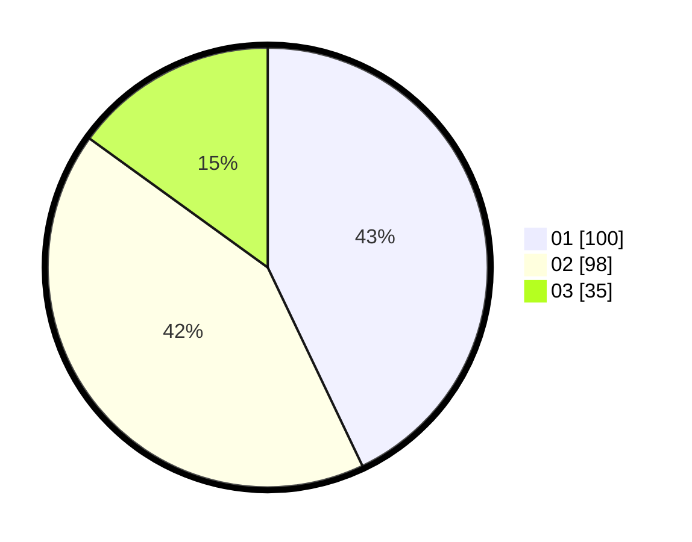

# Hasil

Hasil perolehan suara paslon dapat dilihat pada file paslon-01.txt, paslon-02.txt, dan paslon-03.txt.

Jika tidak ada, artinya data tersebut belum ada pada SIREKAP.

## Perolehan Suara

 * Paslon 01: **100**.
 * Paslon 02: **98**.
 * Paslon 03: **35**.

## Foto C Plano

https://sirekap-obj-formc.kpu.go.id/7b63/pemilu/ppwp/31/75/08/10/01/3175081001065-20240215-005000--d2f258fb-2d73-4d30-b6aa-24e9e4e05536.jpg

https://sirekap-obj-formc.kpu.go.id/7b63/pemilu/ppwp/31/75/08/10/01/3175081001065-20240215-011307--30e43236-48a6-46e0-aa5d-d15970a7780b.jpg

https://sirekap-obj-formc.kpu.go.id/7b63/pemilu/ppwp/31/75/08/10/01/3175081001065-20240215-004823--8e7cbf82-d47a-413c-84f7-dbe19fd91e70.jpg
