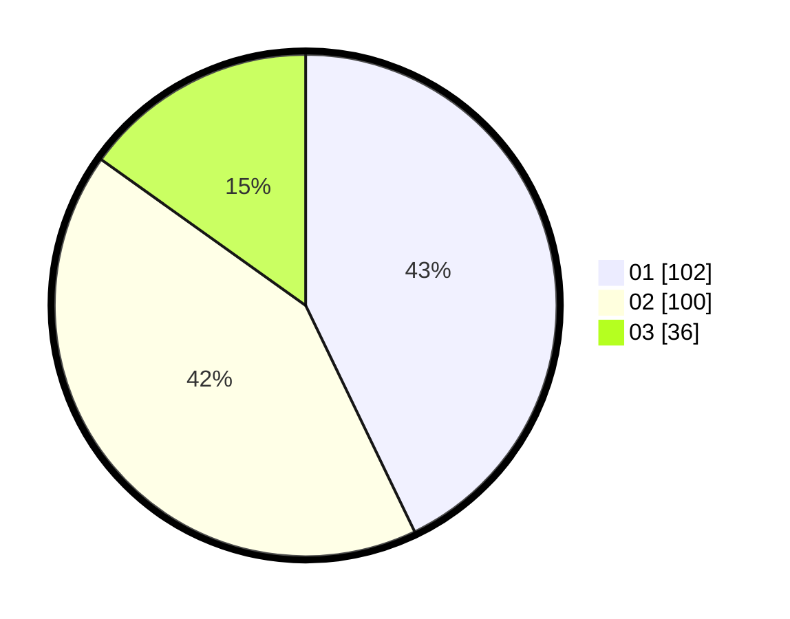

# Hasil

Hasil perolehan suara paslon dapat dilihat pada file paslon-01.txt, paslon-02.txt, dan paslon-03.txt.

Jika tidak ada, artinya data tersebut belum ada pada SIREKAP.

## Perolehan Suara

 * Paslon 01: **102**.
 * Paslon 02: **100**.
 * Paslon 03: **36**.

## Foto C Plano

https://sirekap-obj-formc.kpu.go.id/6861/pemilu/ppwp/31/75/08/10/01/3175081001068-20240214-232928--9ce4cb4f-9a05-429f-af60-8025143ffde0.jpg

https://sirekap-obj-formc.kpu.go.id/6861/pemilu/ppwp/31/75/08/10/01/3175081001068-20240214-233247--b86fd0c5-4830-4ace-9aba-4ef1fdbe72c4.jpg

https://sirekap-obj-formc.kpu.go.id/6861/pemilu/ppwp/31/75/08/10/01/3175081001068-20240214-233320--398764b0-3ed4-4465-a99b-06e5552e7ae9.jpg

## DATA PEMILIH TETAP

Jumlah pemilih dalam DPT: **288**.
 * L: **142**.
 * P: **146**.

## DATA PENGGUNA HAK PILIH

Jumlah pengguna hak pilih dalam DPT: **237**.
 * L: **106**.
 * P: **131**.

Jumlah pengguna hak pilih dalam DPTb: **3**.
 * L: **2**.
 * P: **1**.

Jumlah pengguna hak pilih dalam DPK: **0**.
 * L: **0**.
 * P: **0**.

Jumlah pengguna hak pilih: **240**.
 * L: **108**.
 * P: **132**.

## JUMLAH SUARA SAH DAN TIDAK SAH

JUMLAH SELURUH SUARA SAH: **238**.

JUMLAH SUARA TIDAK SAH: **2**.

JUMLAH SELURUH SUARA SAH DAN SUARA TIDAK SAH: **240**.
