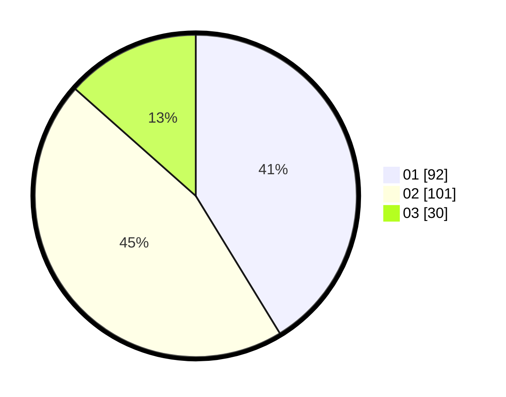

# Hasil

Hasil perolehan suara paslon dapat dilihat pada file paslon-01.txt, paslon-02.txt, dan paslon-03.txt.

Jika tidak ada, artinya data tersebut belum ada pada SIREKAP.

## Perolehan Suara

 * Paslon 01: **92**.
 * Paslon 02: **101**.
 * Paslon 03: **30**.

## Foto C Plano

https://sirekap-obj-formc.kpu.go.id/bab7/pemilu/ppwp/31/75/08/10/01/3175081001072-20240215-015741--12b59cae-aec2-4f6f-b4b1-8bf939aae382.jpg

https://sirekap-obj-formc.kpu.go.id/bab7/pemilu/ppwp/31/75/08/10/01/3175081001072-20240215-015824--31b75a43-3583-4279-9293-9eb700bcaf0d.jpg

https://sirekap-obj-formc.kpu.go.id/bab7/pemilu/ppwp/31/75/08/10/01/3175081001072-20240215-015856--798d40fe-b629-4be1-a960-46137165360d.jpg
