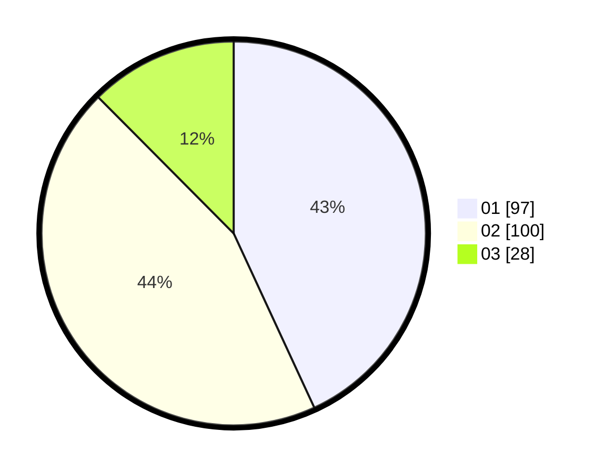

# Hasil

Hasil perolehan suara paslon dapat dilihat pada file paslon-01.txt, paslon-02.txt, dan paslon-03.txt.

Jika tidak ada, artinya data tersebut belum ada pada SIREKAP.

## Perolehan Suara

 * Paslon 01: **97**.
 * Paslon 02: **100**.
 * Paslon 03: **28**.

## Foto C Plano

https://sirekap-obj-formc.kpu.go.id/26f2/pemilu/ppwp/31/75/08/10/01/3175081001078-20240214-203041--299b5ecd-af35-46ce-a9de-6119f6cef27a.jpg

https://sirekap-obj-formc.kpu.go.id/26f2/pemilu/ppwp/31/75/08/10/01/3175081001078-20240214-203113--39553706-7ac6-4e24-bc1f-a19adbd13a65.jpg

https://sirekap-obj-formc.kpu.go.id/26f2/pemilu/ppwp/31/75/08/10/01/3175081001078-20240214-203241--74d2eb45-12ee-496f-bf98-c74772b08a18.jpg
