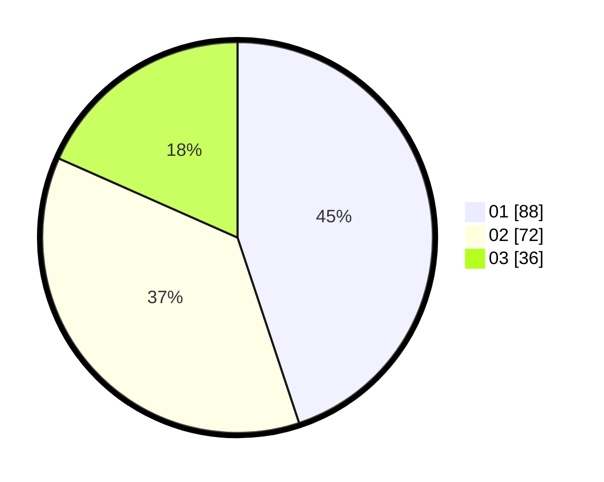

# Hasil

Hasil perolehan suara paslon dapat dilihat pada file paslon-01.txt, paslon-02.txt, dan paslon-03.txt.

Jika tidak ada, artinya data tersebut belum ada pada SIREKAP.

## Perolehan Suara

 * Paslon 01: **88**.
 * Paslon 02: **72**.
 * Paslon 03: **36**.

## Foto C Plano

https://sirekap-obj-formc.kpu.go.id/1559/pemilu/ppwp/31/75/08/10/01/3175081001080-20240214-201216--24131a5e-2d82-40a2-81a4-f23c16979975.jpg

https://sirekap-obj-formc.kpu.go.id/1559/pemilu/ppwp/31/75/08/10/01/3175081001080-20240214-201325--afb78a01-0950-4f03-b891-1133d8a8e183.jpg

https://sirekap-obj-formc.kpu.go.id/1559/pemilu/ppwp/31/75/08/10/01/3175081001080-20240214-201426--ac657dcb-d35f-40c5-9f6e-a55dd70b3bf5.jpg
