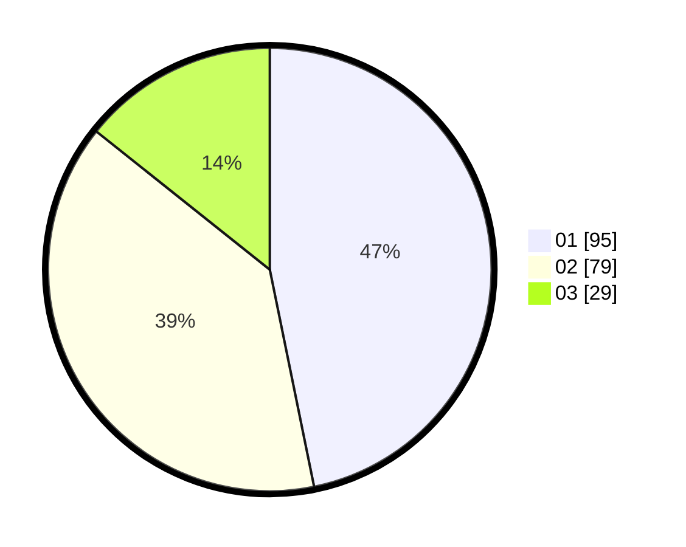

# Hasil

Hasil perolehan suara paslon dapat dilihat pada file paslon-01.txt, paslon-02.txt, dan paslon-03.txt.

Jika tidak ada, artinya data tersebut belum ada pada SIREKAP.

## Perolehan Suara

 * Paslon 01: **95**.
 * Paslon 02: **79**.
 * Paslon 03: **29**.

## Foto C Plano

https://sirekap-obj-formc.kpu.go.id/3875/pemilu/ppwp/31/75/08/10/01/3175081001081-20240215-232727--62fb77f5-4dc1-452e-b204-702c87a66df7.jpg

https://sirekap-obj-formc.kpu.go.id/3875/pemilu/ppwp/31/75/08/10/01/3175081001081-20240215-232731--1010750c-943e-4558-b9d5-2846cbc1ec06.jpg

https://sirekap-obj-formc.kpu.go.id/3875/pemilu/ppwp/31/75/08/10/01/3175081001081-20240215-232729--e722ccda-82c0-4ed5-bd5d-c19e8ad73726.jpg

## DATA PEMILIH TETAP

Jumlah pemilih dalam DPT: **216**.
 * L: **102**.
 * P: **114**.

## DATA PENGGUNA HAK PILIH

Jumlah pengguna hak pilih dalam DPT: **216**.
 * L: **102**.
 * P: **114**.

Jumlah pengguna hak pilih dalam DPTb: **2**.
 * L: **2**.
 * P: **0**.

Jumlah pengguna hak pilih dalam DPK: **0**.
 * L: **0**.
 * P: **0**.

Jumlah pengguna hak pilih: **218**.
 * L: **104**.
 * P: **114**.

## JUMLAH SUARA SAH DAN TIDAK SAH

JUMLAH SELURUH SUARA SAH: **203**.

JUMLAH SUARA TIDAK SAH: **4**.

JUMLAH SELURUH SUARA SAH DAN SUARA TIDAK SAH: **207**.
