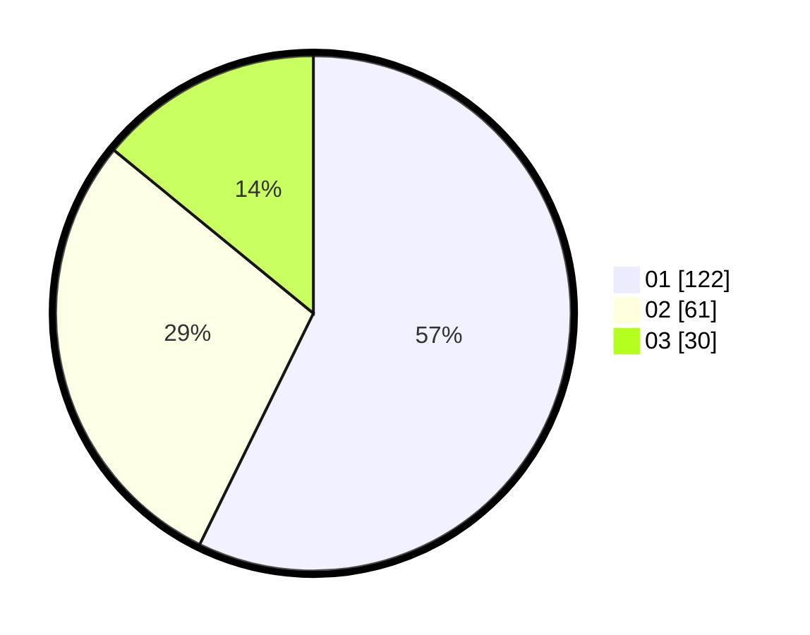

# Hasil

Hasil perolehan suara paslon dapat dilihat pada file paslon-01.txt, paslon-02.txt, dan paslon-03.txt.

Jika tidak ada, artinya data tersebut belum ada pada SIREKAP.

## Perolehan Suara

 * Paslon 01: **122**.
 * Paslon 02: **61**.
 * Paslon 03: **30**.

## Foto C Plano

https://sirekap-obj-formc.kpu.go.id/ba5d/pemilu/ppwp/31/75/08/10/01/3175081001084-20240214-201548--2e7c66a9-4890-406c-88ce-d76d414cceff.jpg

https://sirekap-obj-formc.kpu.go.id/ba5d/pemilu/ppwp/31/75/08/10/01/3175081001084-20240214-201717--f4d863e4-118c-4dfa-8f8b-b7acb0624e57.jpg

https://sirekap-obj-formc.kpu.go.id/ba5d/pemilu/ppwp/31/75/08/10/01/3175081001084-20240214-201836--66f6e996-ce99-48c0-ba68-87e5cb3825a0.jpg

## DATA PEMILIH TETAP

Jumlah pemilih dalam DPT: **255**.
 * L: **128**.
 * P: **127**.

## DATA PENGGUNA HAK PILIH

Jumlah pengguna hak pilih dalam DPT: **205**.
 * L: **102**.
 * P: **163**.

Jumlah pengguna hak pilih dalam DPTb: **2**.
 * L: **0**.
 * P: **2**.

Jumlah pengguna hak pilih dalam DPK: **9**.
 * L: **6**.
 * P: **3**.

Jumlah pengguna hak pilih: **216**.
 * L: **108**.
 * P: **108**.

## JUMLAH SUARA SAH DAN TIDAK SAH

JUMLAH SELURUH SUARA SAH: **213**.

JUMLAH SUARA TIDAK SAH: **3**.

JUMLAH SELURUH SUARA SAH DAN SUARA TIDAK SAH: **216**.
