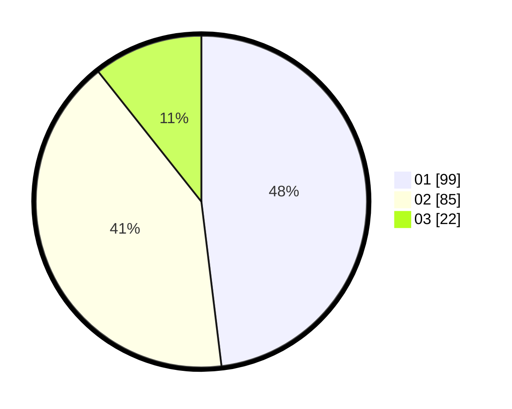

# Hasil

Hasil perolehan suara paslon dapat dilihat pada file paslon-01.txt, paslon-02.txt, dan paslon-03.txt.

Jika tidak ada, artinya data tersebut belum ada pada SIREKAP.

## Perolehan Suara

 * Paslon 01: **99**.
 * Paslon 02: **85**.
 * Paslon 03: **22**.

## Foto C Plano

https://sirekap-obj-formc.kpu.go.id/bde6/pemilu/ppwp/31/75/08/10/01/3175081001087-20240214-220332--564a2e89-05b3-4476-9a4b-aeef608906bb.jpg

https://sirekap-obj-formc.kpu.go.id/bde6/pemilu/ppwp/31/75/08/10/01/3175081001087-20240214-220422--70ead315-e60f-485f-8683-67cee5837551.jpg

https://sirekap-obj-formc.kpu.go.id/bde6/pemilu/ppwp/31/75/08/10/01/3175081001087-20240214-221531--42582b24-2f21-4a3c-80a4-62016ad2a582.jpg
