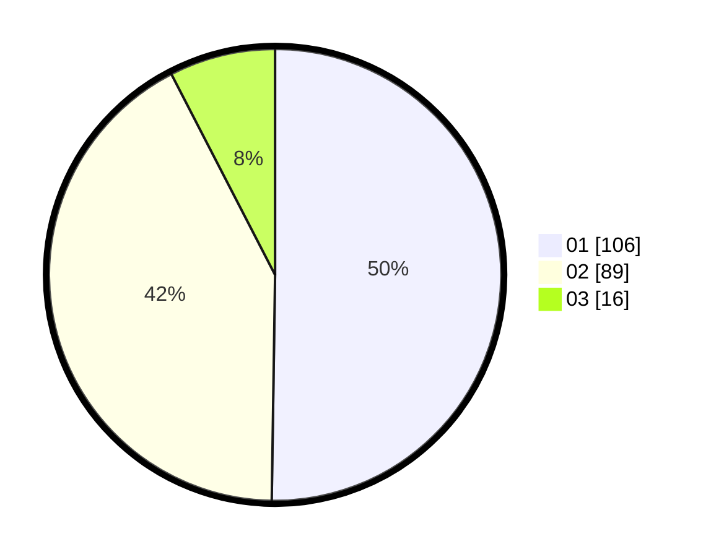

# Hasil

Hasil perolehan suara paslon dapat dilihat pada file paslon-01.txt, paslon-02.txt, dan paslon-03.txt.

Jika tidak ada, artinya data tersebut belum ada pada SIREKAP.

## Perolehan Suara

 * Paslon 01: **106**.
 * Paslon 02: **89**.
 * Paslon 03: **16**.

## Foto C Plano

https://sirekap-obj-formc.kpu.go.id/04b8/pemilu/ppwp/31/75/08/10/01/3175081001089-20240214-233650--bfbeb28d-7f68-48cb-9836-b186517f3747.jpg

https://sirekap-obj-formc.kpu.go.id/04b8/pemilu/ppwp/31/75/08/10/01/3175081001089-20240214-233752--de823a10-0177-486e-97a1-4969443eaebc.jpg

https://sirekap-obj-formc.kpu.go.id/04b8/pemilu/ppwp/31/75/08/10/01/3175081001089-20240214-233854--ec3321cb-2b42-453e-8183-9d4b6e1dd58e.jpg
