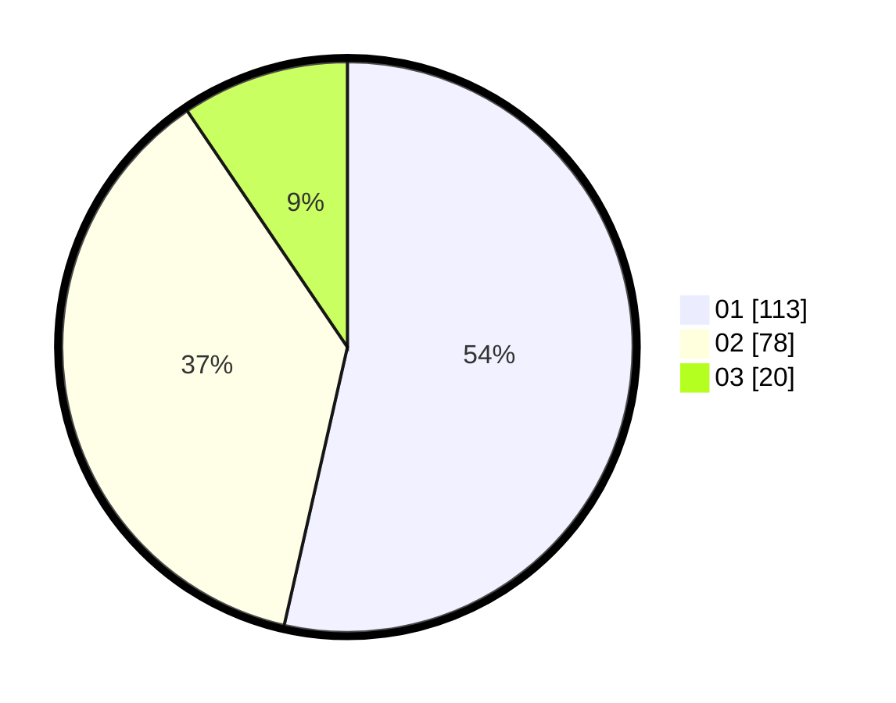

# Hasil

Hasil perolehan suara paslon dapat dilihat pada file paslon-01.txt, paslon-02.txt, dan paslon-03.txt.

Jika tidak ada, artinya data tersebut belum ada pada SIREKAP.

## Perolehan Suara

 * Paslon 01: **113**.
 * Paslon 02: **78**.
 * Paslon 03: **20**.

## Foto C Plano

https://sirekap-obj-formc.kpu.go.id/541c/pemilu/ppwp/31/75/08/10/01/3175081001091-20240214-213258--406287be-10a3-4211-96ac-506d002bf6a0.jpg

https://sirekap-obj-formc.kpu.go.id/541c/pemilu/ppwp/31/75/08/10/01/3175081001091-20240214-213427--522ecfa7-be86-48a5-bb51-51a3b1fbf2cd.jpg

https://sirekap-obj-formc.kpu.go.id/541c/pemilu/ppwp/31/75/08/10/01/3175081001091-20240214-231544--65ad662b-b363-4aa8-a274-472272ccc49d.jpg
