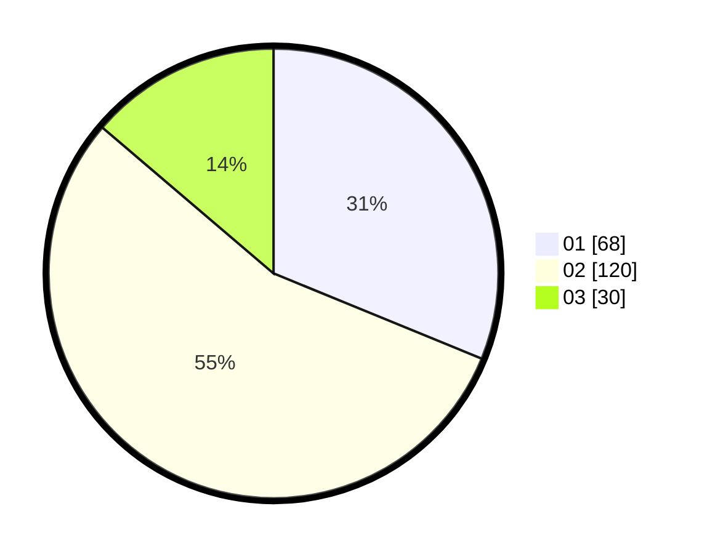

# Hasil

Hasil perolehan suara paslon dapat dilihat pada file paslon-01.txt, paslon-02.txt, dan paslon-03.txt.

Jika tidak ada, artinya data tersebut belum ada pada SIREKAP.

## Perolehan Suara

 * Paslon 01: **68**.
 * Paslon 02: **120**.
 * Paslon 03: **30**.

## Foto C Plano

https://sirekap-obj-formc.kpu.go.id/08e2/pemilu/ppwp/31/75/08/10/01/3175081001094-20240214-200919--c41ea77d-df96-4544-abfd-3e40463c1ced.jpg

https://sirekap-obj-formc.kpu.go.id/08e2/pemilu/ppwp/31/75/08/10/01/3175081001094-20240214-155705--8def06f9-a572-4e6e-a185-572722cff9fc.jpg

https://sirekap-obj-formc.kpu.go.id/08e2/pemilu/ppwp/31/75/08/10/01/3175081001094-20240214-160055--b1a9ccea-2ad6-44fe-bcee-271030ab1a2d.jpg
