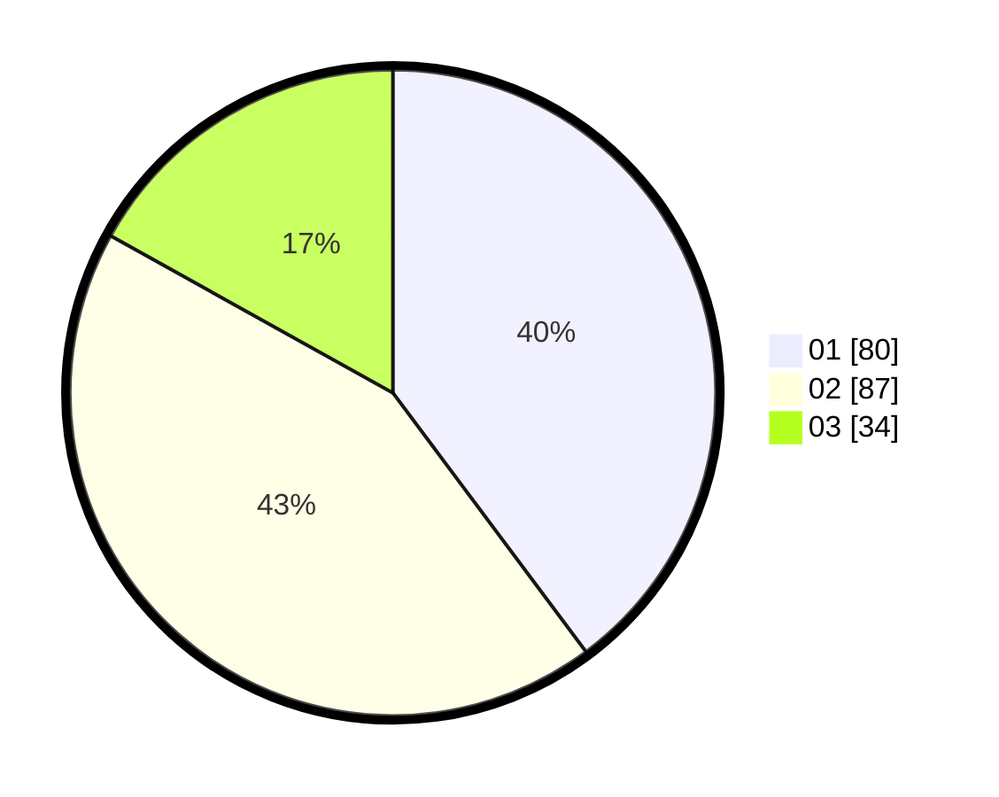

# Hasil

Hasil perolehan suara paslon dapat dilihat pada file paslon-01.txt, paslon-02.txt, dan paslon-03.txt.

Jika tidak ada, artinya data tersebut belum ada pada SIREKAP.

## Perolehan Suara

 * Paslon 01: **80**.
 * Paslon 02: **87**.
 * Paslon 03: **34**.

## Foto C Plano

https://sirekap-obj-formc.kpu.go.id/954c/pemilu/ppwp/31/75/08/10/01/3175081001097-20240214-155434--c360f93a-c044-4926-aa73-6d7e036e943e.jpg

https://sirekap-obj-formc.kpu.go.id/954c/pemilu/ppwp/31/75/08/10/01/3175081001097-20240214-155457--14e0cc41-69b9-4f73-91d9-f085301d6076.jpg

https://sirekap-obj-formc.kpu.go.id/954c/pemilu/ppwp/31/75/08/10/01/3175081001097-20240214-155515--61ca4f72-f6fe-4aa1-9abd-5bd96288aee4.jpg

## DATA PEMILIH TETAP

Jumlah pemilih dalam DPT: **266**.
 * L: **126**.
 * P: **140**.

## DATA PENGGUNA HAK PILIH

Jumlah pengguna hak pilih dalam DPT: **200**.
 * L: **99**.
 * P: **101**.

Jumlah pengguna hak pilih dalam DPTb: **2**.
 * L: **1**.
 * P: **1**.

Jumlah pengguna hak pilih dalam DPK: **2**.
 * L: **2**.
 * P: **0**.

Jumlah pengguna hak pilih: **204**.
 * L: **102**.
 * P: **102**.

## JUMLAH SUARA SAH DAN TIDAK SAH

JUMLAH SELURUH SUARA SAH: **201**.

JUMLAH SUARA TIDAK SAH: **3**.

JUMLAH SELURUH SUARA SAH DAN SUARA TIDAK SAH: **204**.
