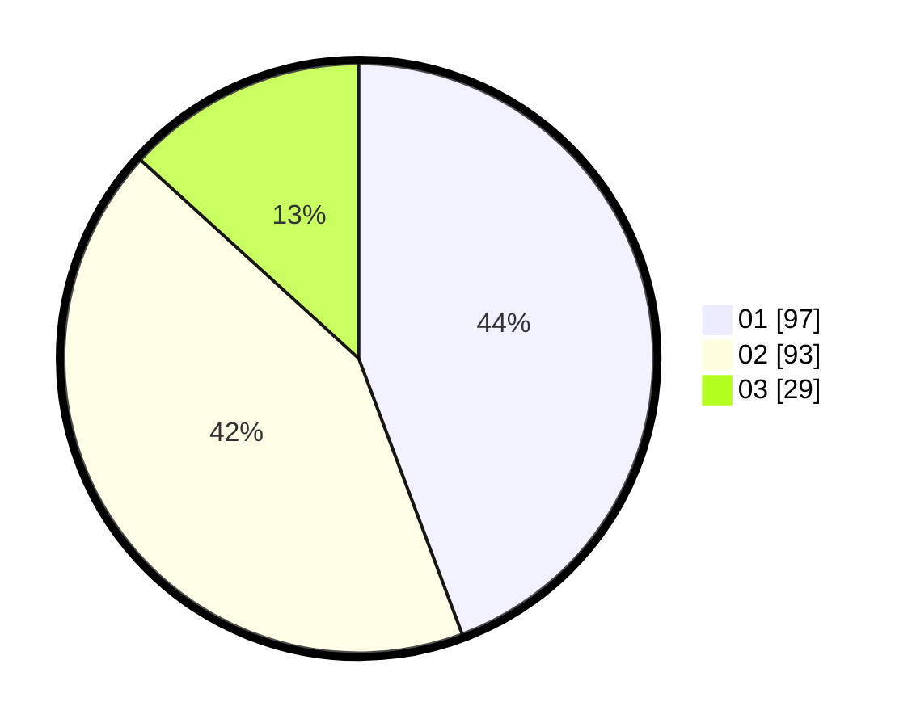

# Hasil

Hasil perolehan suara paslon dapat dilihat pada file paslon-01.txt, paslon-02.txt, dan paslon-03.txt.

Jika tidak ada, artinya data tersebut belum ada pada SIREKAP.

## Perolehan Suara

 * Paslon 01: **97**.
 * Paslon 02: **93**.
 * Paslon 03: **29**.

## Foto C Plano

https://sirekap-obj-formc.kpu.go.id/4e80/pemilu/ppwp/31/75/08/10/01/3175081001103-20240214-184933--5ed226a8-d7cc-4cb7-ae58-8fed2083a94f.jpg

https://sirekap-obj-formc.kpu.go.id/4e80/pemilu/ppwp/31/75/08/10/01/3175081001103-20240214-232255--9a1b7bf4-afcb-4f87-84e2-79aca05e3c19.jpg
