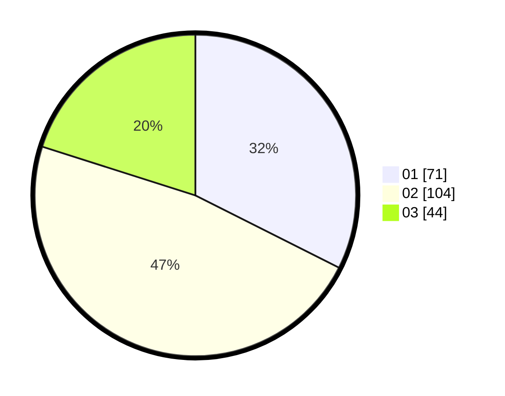

# Hasil

Hasil perolehan suara paslon dapat dilihat pada file paslon-01.txt, paslon-02.txt, dan paslon-03.txt.

Jika tidak ada, artinya data tersebut belum ada pada SIREKAP.

## Perolehan Suara

 * Paslon 01: **71**.
 * Paslon 02: **104**.
 * Paslon 03: **44**.

## Foto C Plano

https://sirekap-obj-formc.kpu.go.id/f826/pemilu/ppwp/31/75/08/10/01/3175081001107-20240214-214659--e1377625-c647-4519-b33b-67f1af875fe0.jpg

https://sirekap-obj-formc.kpu.go.id/f826/pemilu/ppwp/31/75/08/10/01/3175081001107-20240214-214645--e1fac4f4-1418-424c-b225-d8ab9f398f60.jpg

https://sirekap-obj-formc.kpu.go.id/f826/pemilu/ppwp/31/75/08/10/01/3175081001107-20240214-181427--ea3ada60-fe0e-483e-a999-ddda80994f3a.jpg
