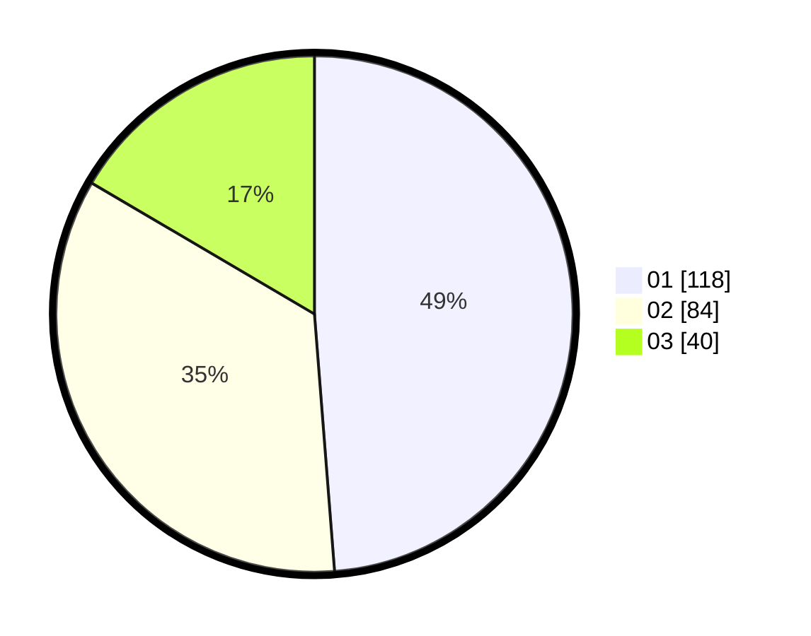

# Hasil

Hasil perolehan suara paslon dapat dilihat pada file paslon-01.txt, paslon-02.txt, dan paslon-03.txt.

Jika tidak ada, artinya data tersebut belum ada pada SIREKAP.

## Perolehan Suara

 * Paslon 01: **118**.
 * Paslon 02: **84**.
 * Paslon 03: **40**.

## Foto C Plano

https://sirekap-obj-formc.kpu.go.id/c684/pemilu/ppwp/31/75/08/10/01/3175081001108-20240214-211558--79c4abbb-072b-4efd-816a-3fab18f3746d.jpg

https://sirekap-obj-formc.kpu.go.id/c684/pemilu/ppwp/31/75/08/10/01/3175081001108-20240214-212136--27cbf509-edb7-47e1-ab1b-fb4abd2185bf.jpg

https://sirekap-obj-formc.kpu.go.id/c684/pemilu/ppwp/31/75/08/10/01/3175081001108-20240214-212334--743e2c89-e20f-4912-b790-356d0a3404dc.jpg
