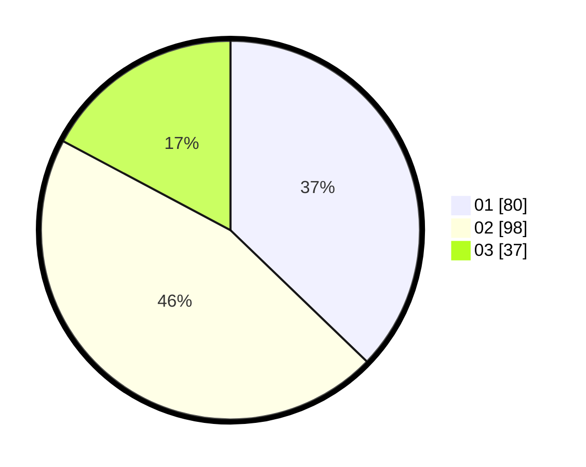

# Hasil

Hasil perolehan suara paslon dapat dilihat pada file paslon-01.txt, paslon-02.txt, dan paslon-03.txt.

Jika tidak ada, artinya data tersebut belum ada pada SIREKAP.

## Perolehan Suara

 * Paslon 01: **80**.
 * Paslon 02: **98**.
 * Paslon 03: **37**.

## Foto C Plano

https://sirekap-obj-formc.kpu.go.id/d831/pemilu/ppwp/31/75/08/10/01/3175081001111-20240215-021944--6b4746eb-1d50-4461-b406-9d590e62f647.jpg

https://sirekap-obj-formc.kpu.go.id/d831/pemilu/ppwp/31/75/08/10/01/3175081001111-20240215-022006--50c9b47c-407f-401c-bf2d-0fd0f7bbccf0.jpg

https://sirekap-obj-formc.kpu.go.id/d831/pemilu/ppwp/31/75/08/10/01/3175081001111-20240215-021955--40526ad3-ce3f-4cf7-a6fe-4c0cc110971a.jpg

## DATA PEMILIH TETAP

Jumlah pemilih dalam DPT: **269**.
 * L: **133**.
 * P: **136**.

## DATA PENGGUNA HAK PILIH

Jumlah pengguna hak pilih dalam DPT: **215**.
 * L: **107**.
 * P: **108**.

Jumlah pengguna hak pilih dalam DPTb: **0**.
 * L: **0**.
 * P: **0**.

Jumlah pengguna hak pilih dalam DPK: **1**.
 * L: **0**.
 * P: **1**.

Jumlah pengguna hak pilih: **216**.
 * L: **107**.
 * P: **109**.

## JUMLAH SUARA SAH DAN TIDAK SAH

JUMLAH SELURUH SUARA SAH: **215**.

JUMLAH SUARA TIDAK SAH: **1**.

JUMLAH SELURUH SUARA SAH DAN SUARA TIDAK SAH: **216**.
