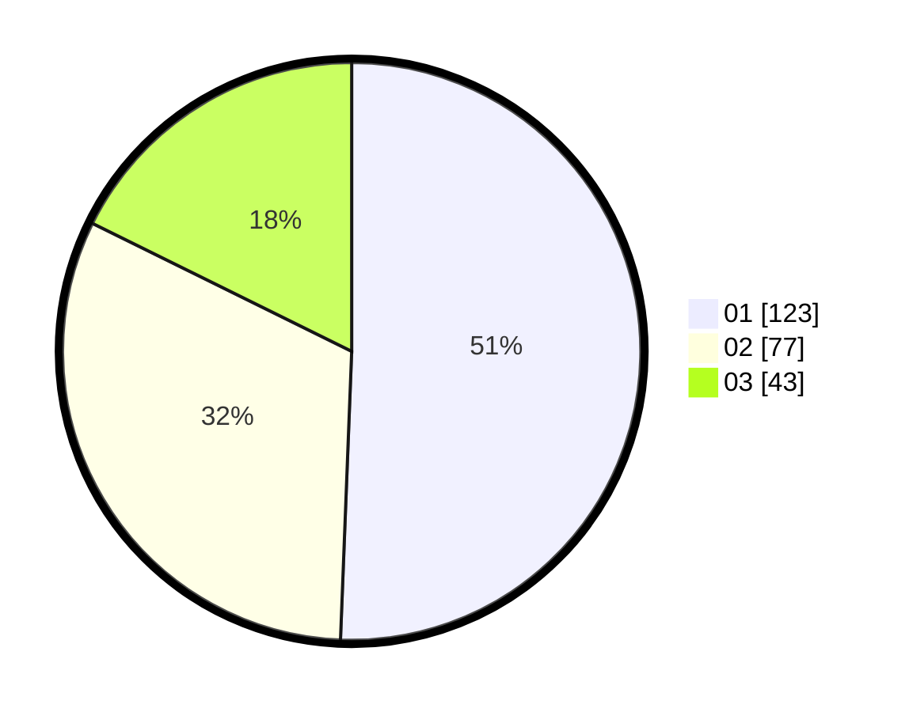

# Hasil

Hasil perolehan suara paslon dapat dilihat pada file paslon-01.txt, paslon-02.txt, dan paslon-03.txt.

Jika tidak ada, artinya data tersebut belum ada pada SIREKAP.

## Perolehan Suara

 * Paslon 01: **123**.
 * Paslon 02: **77**.
 * Paslon 03: **43**.

## Foto C Plano

https://sirekap-obj-formc.kpu.go.id/f606/pemilu/ppwp/31/75/08/10/01/3175081001113-20240214-192659--4daf2cc1-b184-40af-8a76-a85a810839d3.jpg

https://sirekap-obj-formc.kpu.go.id/f606/pemilu/ppwp/31/75/08/10/01/3175081001113-20240214-192857--7bd15bc1-676f-48a4-9123-85ee527f576e.jpg

https://sirekap-obj-formc.kpu.go.id/f606/pemilu/ppwp/31/75/08/10/01/3175081001113-20240214-220337--998b3c41-ecad-4fac-ac3f-c67b914f955b.jpg
