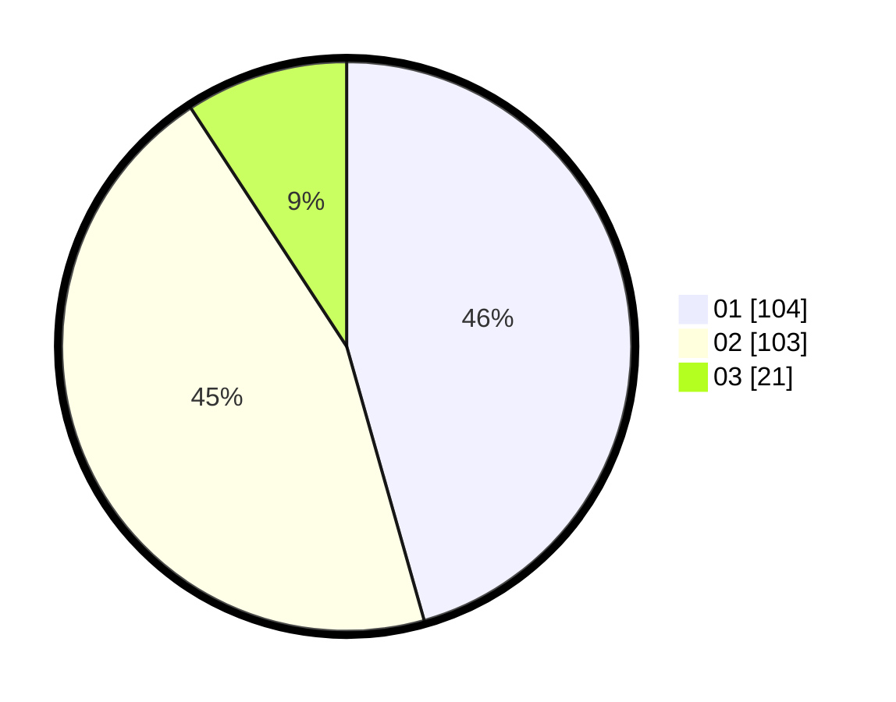

# Hasil

Hasil perolehan suara paslon dapat dilihat pada file paslon-01.txt, paslon-02.txt, dan paslon-03.txt.

Jika tidak ada, artinya data tersebut belum ada pada SIREKAP.

## Perolehan Suara

 * Paslon 01: **104**.
 * Paslon 02: **103**.
 * Paslon 03: **21**.

## Foto C Plano

https://sirekap-obj-formc.kpu.go.id/362f/pemilu/ppwp/31/75/08/10/02/3175081002004-20240214-194533--b2137a41-09fe-4206-830a-f051866b37f4.jpg

https://sirekap-obj-formc.kpu.go.id/362f/pemilu/ppwp/31/75/08/10/02/3175081002004-20240214-233412--a064f5ec-ace5-4ada-8f7d-0f6611d2cb0d.jpg

https://sirekap-obj-formc.kpu.go.id/362f/pemilu/ppwp/31/75/08/10/02/3175081002004-20240214-194609--45aca7e9-fb21-4462-bb6a-bdf6bbec79ce.jpg

## DATA PEMILIH TETAP

Jumlah pemilih dalam DPT: **258**.
 * L: **125**.
 * P: **133**.

## DATA PENGGUNA HAK PILIH

Jumlah pengguna hak pilih dalam DPT: **215**.
 * L: **99**.
 * P: **116**.

Jumlah pengguna hak pilih dalam DPTb: **15**.
 * L: **5**.
 * P: **10**.

Jumlah pengguna hak pilih dalam DPK: **1**.
 * L: **0**.
 * P: **1**.

Jumlah pengguna hak pilih: **231**.
 * L: **104**.
 * P: **127**.

## JUMLAH SUARA SAH DAN TIDAK SAH

JUMLAH SELURUH SUARA SAH: **228**.

JUMLAH SUARA TIDAK SAH: **3**.

JUMLAH SELURUH SUARA SAH DAN SUARA TIDAK SAH: **231**.
