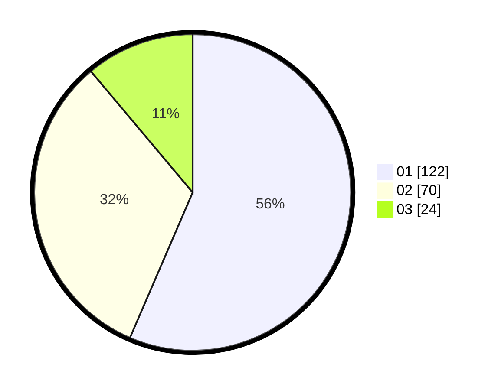

# Hasil

Hasil perolehan suara paslon dapat dilihat pada file paslon-01.txt, paslon-02.txt, dan paslon-03.txt.

Jika tidak ada, artinya data tersebut belum ada pada SIREKAP.

## Perolehan Suara

 * Paslon 01: **122**.
 * Paslon 02: **70**.
 * Paslon 03: **24**.

## Foto C Plano

https://sirekap-obj-formc.kpu.go.id/ef8c/pemilu/ppwp/31/75/08/10/02/3175081002013-20240215-224056--828b3322-779c-407e-8d45-c55f4c38c39f.jpg

https://sirekap-obj-formc.kpu.go.id/ef8c/pemilu/ppwp/31/75/08/10/02/3175081002013-20240215-224058--af6dbdf8-4dad-45a4-8c46-054e9aea9dda.jpg

https://sirekap-obj-formc.kpu.go.id/ef8c/pemilu/ppwp/31/75/08/10/02/3175081002013-20240215-224056--8a92185d-b790-4f8b-9d20-083ddc9c212a.jpg

## DATA PEMILIH TETAP

Jumlah pemilih dalam DPT: **258**.
 * L: **129**.
 * P: **129**.

## DATA PENGGUNA HAK PILIH

Jumlah pengguna hak pilih dalam DPT: **213**.
 * L: **106**.
 * P: **107**.

Jumlah pengguna hak pilih dalam DPTb: **0**.
 * L: **0**.
 * P: **0**.

Jumlah pengguna hak pilih dalam DPK: **4**.
 * L: **2**.
 * P: **2**.

Jumlah pengguna hak pilih: **217**.
 * L: **108**.
 * P: **109**.

## JUMLAH SUARA SAH DAN TIDAK SAH

JUMLAH SELURUH SUARA SAH: **216**.

JUMLAH SUARA TIDAK SAH: **1**.

JUMLAH SELURUH SUARA SAH DAN SUARA TIDAK SAH: **217**.
