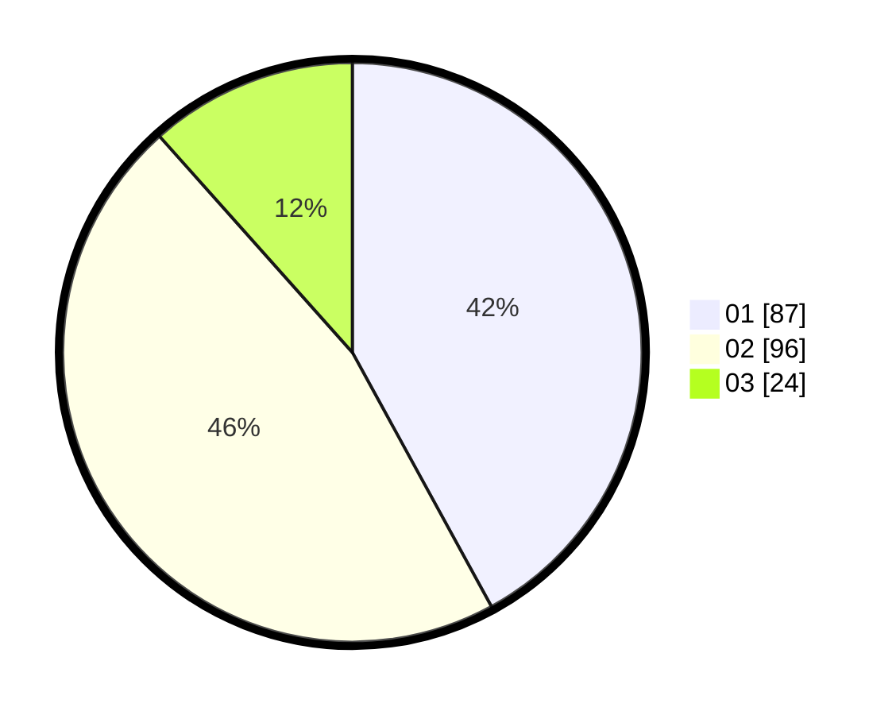

# Hasil

Hasil perolehan suara paslon dapat dilihat pada file paslon-01.txt, paslon-02.txt, dan paslon-03.txt.

Jika tidak ada, artinya data tersebut belum ada pada SIREKAP.

## Perolehan Suara

 * Paslon 01: **87**.
 * Paslon 02: **96**.
 * Paslon 03: **24**.

## Foto C Plano

https://sirekap-obj-formc.kpu.go.id/a17c/pemilu/ppwp/31/75/08/10/02/3175081002015-20240214-232657--11040ee2-912d-4fd9-9f3b-5a2d8eaef3d3.jpg

https://sirekap-obj-formc.kpu.go.id/a17c/pemilu/ppwp/31/75/08/10/02/3175081002015-20240214-232722--10b17db5-23ee-48a0-921b-4ac2fec23540.jpg

https://sirekap-obj-formc.kpu.go.id/a17c/pemilu/ppwp/31/75/08/10/02/3175081002015-20240214-232744--2531e8e9-f909-421a-be63-05f6694e759b.jpg
