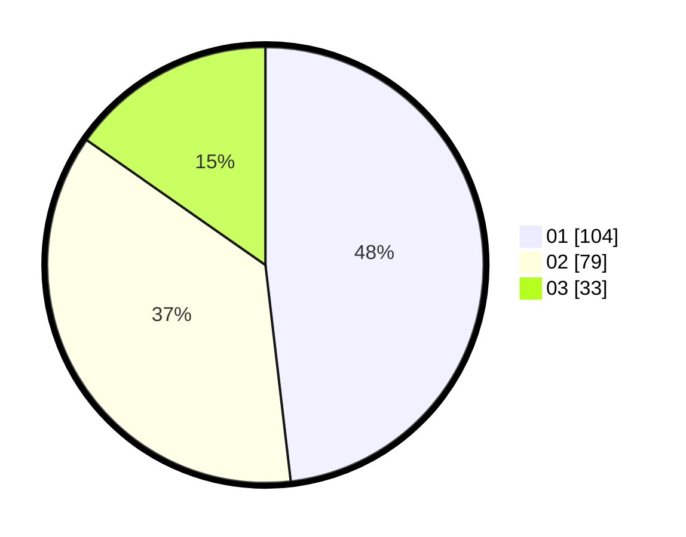

# Hasil

Hasil perolehan suara paslon dapat dilihat pada file paslon-01.txt, paslon-02.txt, dan paslon-03.txt.

Jika tidak ada, artinya data tersebut belum ada pada SIREKAP.

## Perolehan Suara

 * Paslon 01: **104**.
 * Paslon 02: **79**.
 * Paslon 03: **33**.

## Foto C Plano

https://sirekap-obj-formc.kpu.go.id/4eb0/pemilu/ppwp/31/75/08/10/02/3175081002017-20240214-155349--b51f9c0a-0847-44dc-a3c8-fb11252d8079.jpg

https://sirekap-obj-formc.kpu.go.id/4eb0/pemilu/ppwp/31/75/08/10/02/3175081002017-20240214-155521--491886c0-4fc2-4637-8f0d-59c41b5d3e9b.jpg

https://sirekap-obj-formc.kpu.go.id/4eb0/pemilu/ppwp/31/75/08/10/02/3175081002017-20240214-155711--12c4fe77-d721-493a-92db-5578279d99c1.jpg

## DATA PEMILIH TETAP

Jumlah pemilih dalam DPT: **254**.
 * L: **117**.
 * P: **137**.

## DATA PENGGUNA HAK PILIH

Jumlah pengguna hak pilih dalam DPT: **209**.
 * L: **92**.
 * P: **117**.

Jumlah pengguna hak pilih dalam DPTb: **1**.
 * L: **1**.
 * P: **0**.

Jumlah pengguna hak pilih dalam DPK: **8**.
 * L: **5**.
 * P: **3**.

Jumlah pengguna hak pilih: **218**.
 * L: **98**.
 * P: **120**.

## JUMLAH SUARA SAH DAN TIDAK SAH

JUMLAH SELURUH SUARA SAH: **216**.

JUMLAH SUARA TIDAK SAH: **2**.

JUMLAH SELURUH SUARA SAH DAN SUARA TIDAK SAH: **218**.
