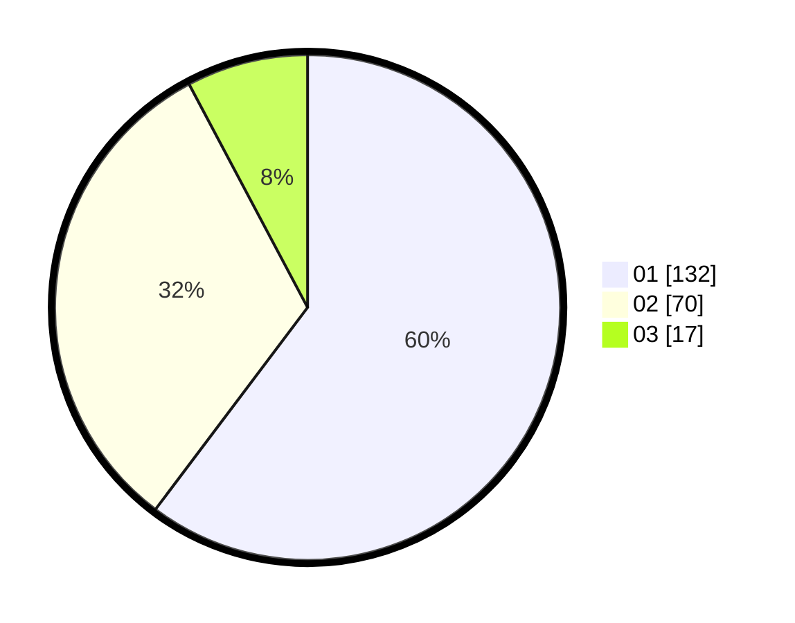

# Hasil

Hasil perolehan suara paslon dapat dilihat pada file paslon-01.txt, paslon-02.txt, dan paslon-03.txt.

Jika tidak ada, artinya data tersebut belum ada pada SIREKAP.

## Perolehan Suara

 * Paslon 01: **132**.
 * Paslon 02: **70**.
 * Paslon 03: **17**.

## Foto C Plano

https://sirekap-obj-formc.kpu.go.id/9522/pemilu/ppwp/31/75/08/10/02/3175081002019-20240215-033959--d4898931-82c6-4e39-a682-a3784c8e67ab.jpg

https://sirekap-obj-formc.kpu.go.id/9522/pemilu/ppwp/31/75/08/10/02/3175081002019-20240215-034052--78c4738b-26ae-49d4-8b1a-d0696ca689d3.jpg

https://sirekap-obj-formc.kpu.go.id/9522/pemilu/ppwp/31/75/08/10/02/3175081002019-20240215-034155--a8c2ce88-4dd5-437f-a37a-9a478af119cf.jpg
