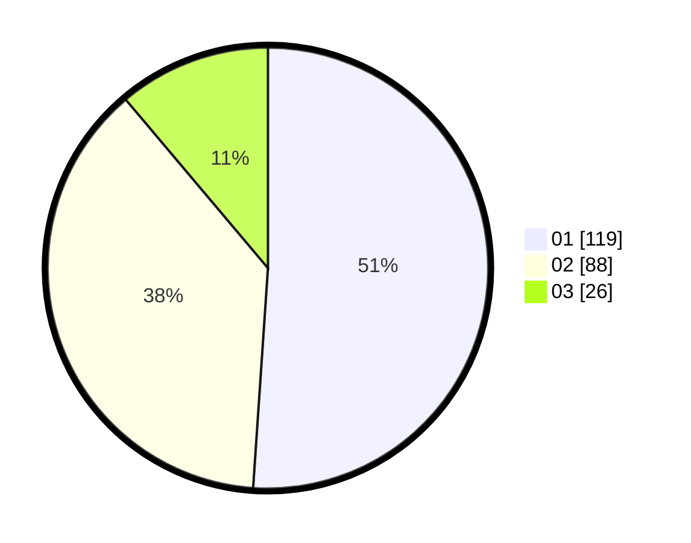

# Hasil

Hasil perolehan suara paslon dapat dilihat pada file paslon-01.txt, paslon-02.txt, dan paslon-03.txt.

Jika tidak ada, artinya data tersebut belum ada pada SIREKAP.

## Perolehan Suara

 * Paslon 01: **119**.
 * Paslon 02: **88**.
 * Paslon 03: **26**.

## Foto C Plano

https://sirekap-obj-formc.kpu.go.id/04be/pemilu/ppwp/31/75/08/10/02/3175081002020-20240214-162237--9ed9f028-5ff5-4de1-a464-9d3212b516eb.jpg

https://sirekap-obj-formc.kpu.go.id/04be/pemilu/ppwp/31/75/08/10/02/3175081002020-20240214-162234--fc4e93f4-acee-4997-92b2-45fa782c6b95.jpg

https://sirekap-obj-formc.kpu.go.id/04be/pemilu/ppwp/31/75/08/10/02/3175081002020-20240214-162230--0db4d523-da61-4aec-90dd-aa3f7d2553ed.jpg

## DATA PEMILIH TETAP

Jumlah pemilih dalam DPT: **273**.
 * L: **135**.
 * P: **138**.

## DATA PENGGUNA HAK PILIH

Jumlah pengguna hak pilih dalam DPT: **221**.
 * L: **104**.
 * P: **117**.

Jumlah pengguna hak pilih dalam DPTb: **16**.
 * L: **10**.
 * P: **6**.

Jumlah pengguna hak pilih dalam DPK: **0**.
 * L: **0**.
 * P: **0**.

Jumlah pengguna hak pilih: **237**.
 * L: **114**.
 * P: **123**.

## JUMLAH SUARA SAH DAN TIDAK SAH

JUMLAH SELURUH SUARA SAH: **233**.

JUMLAH SUARA TIDAK SAH: **4**.

JUMLAH SELURUH SUARA SAH DAN SUARA TIDAK SAH: **237**.
