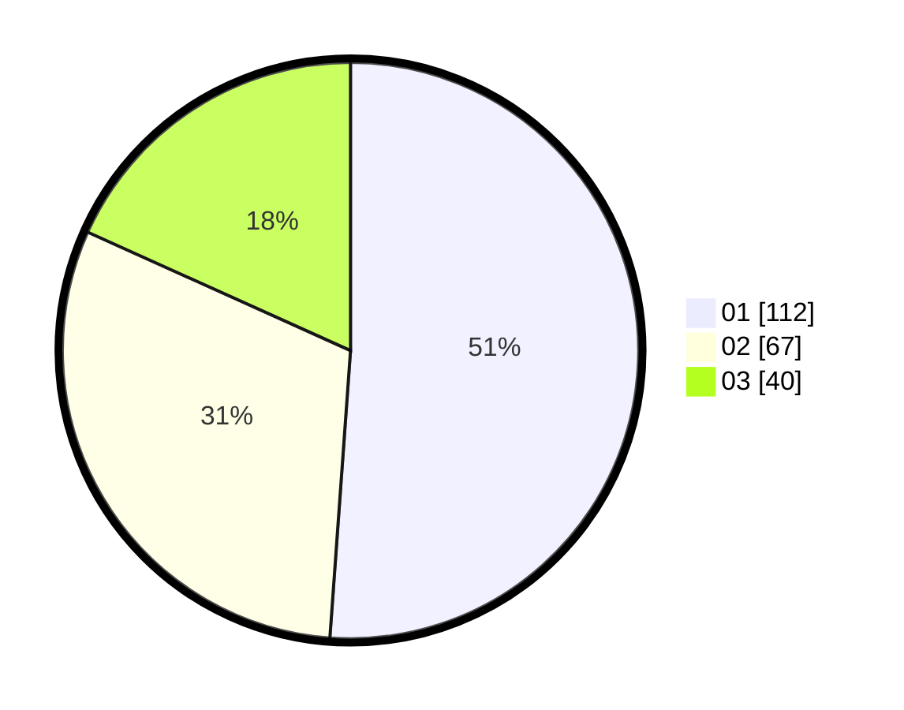

# Hasil

Hasil perolehan suara paslon dapat dilihat pada file paslon-01.txt, paslon-02.txt, dan paslon-03.txt.

Jika tidak ada, artinya data tersebut belum ada pada SIREKAP.

## Perolehan Suara

 * Paslon 01: **112**.
 * Paslon 02: **67**.
 * Paslon 03: **40**.

## Foto C Plano

https://sirekap-obj-formc.kpu.go.id/fd7d/pemilu/ppwp/31/75/08/10/02/3175081002023-20240214-233740--96957797-e340-49b1-b0b3-ba2b49a23cb3.jpg

https://sirekap-obj-formc.kpu.go.id/fd7d/pemilu/ppwp/31/75/08/10/02/3175081002023-20240216-115751--f9b12f92-020a-4646-bf4a-0b55de82d7e6.jpg

https://sirekap-obj-formc.kpu.go.id/fd7d/pemilu/ppwp/31/75/08/10/02/3175081002023-20240214-233901--989ca31a-82fa-41fc-9252-6b942feb5b1d.jpg

## DATA PEMILIH TETAP

Jumlah pemilih dalam DPT: **270**.
 * L: **132**.
 * P: **138**.

## DATA PENGGUNA HAK PILIH

Jumlah pengguna hak pilih dalam DPT: **217**.
 * L: **105**.
 * P: **112**.

Jumlah pengguna hak pilih dalam DPTb: **2**.
 * L: **1**.
 * P: **1**.

Jumlah pengguna hak pilih dalam DPK: **3**.
 * L: **0**.
 * P: **3**.

Jumlah pengguna hak pilih: **222**.
 * L: **106**.
 * P: **116**.

## JUMLAH SUARA SAH DAN TIDAK SAH

JUMLAH SELURUH SUARA SAH: **219**.

JUMLAH SUARA TIDAK SAH: **3**.

JUMLAH SELURUH SUARA SAH DAN SUARA TIDAK SAH: **222**.
