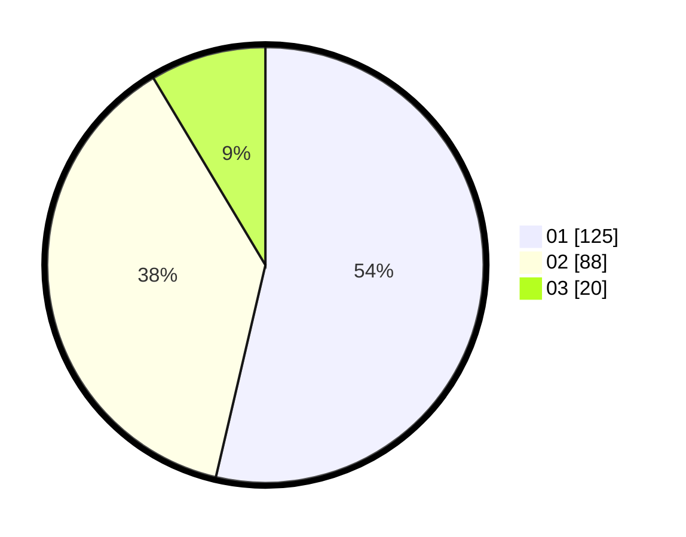

# Hasil

Hasil perolehan suara paslon dapat dilihat pada file paslon-01.txt, paslon-02.txt, dan paslon-03.txt.

Jika tidak ada, artinya data tersebut belum ada pada SIREKAP.

## Perolehan Suara

 * Paslon 01: **125**.
 * Paslon 02: **88**.
 * Paslon 03: **20**.

## Foto C Plano

https://sirekap-obj-formc.kpu.go.id/dba1/pemilu/ppwp/31/75/08/10/02/3175081002028-20240215-012326--6c89c3fb-f3bd-4c53-871d-db52070235a2.jpg

https://sirekap-obj-formc.kpu.go.id/dba1/pemilu/ppwp/31/75/08/10/02/3175081002028-20240215-012406--8a7098ad-26f4-48ed-a7d8-c45b43b67e5f.jpg

https://sirekap-obj-formc.kpu.go.id/dba1/pemilu/ppwp/31/75/08/10/02/3175081002028-20240215-012443--d18b08fe-3df2-4ffc-b960-377abcce88c4.jpg
