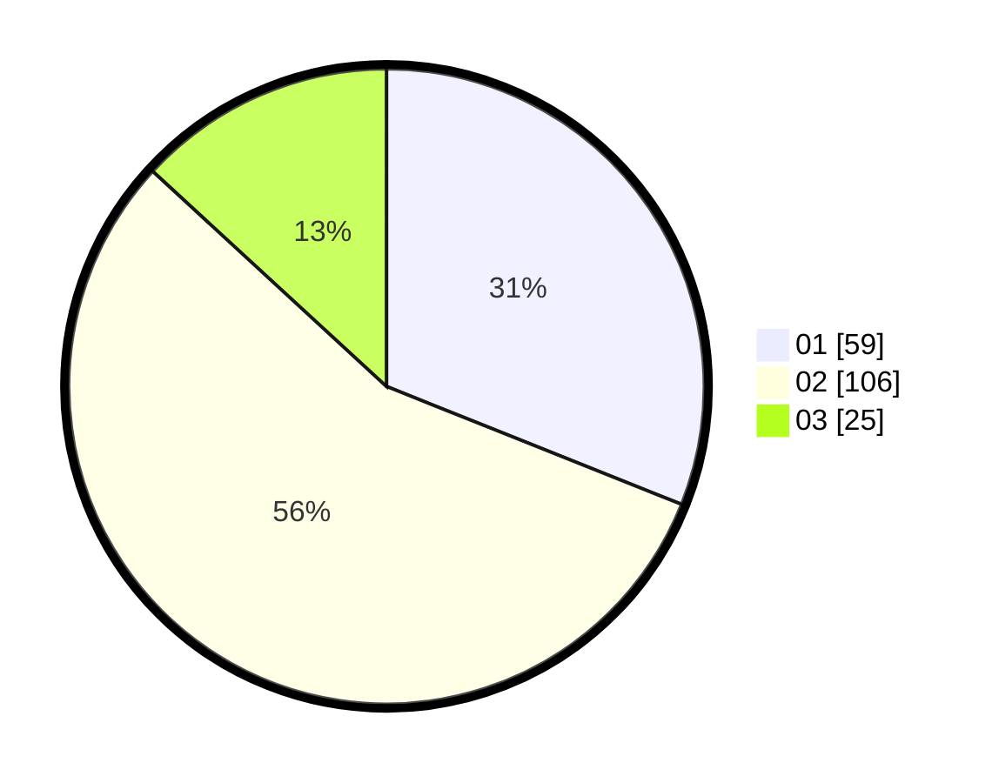

# Hasil

Hasil perolehan suara paslon dapat dilihat pada file paslon-01.txt, paslon-02.txt, dan paslon-03.txt.

Jika tidak ada, artinya data tersebut belum ada pada SIREKAP.

## Perolehan Suara

 * Paslon 01: **59**.
 * Paslon 02: **106**.
 * Paslon 03: **25**.

## Foto C Plano

https://sirekap-obj-formc.kpu.go.id/d959/pemilu/ppwp/31/75/08/10/02/3175081002032-20240217-114833--aaca6b1d-9a13-47ec-ace1-d307e09c0509.jpg

https://sirekap-obj-formc.kpu.go.id/d959/pemilu/ppwp/31/75/08/10/02/3175081002032-20240217-114834--c6aeab20-cb85-4821-8e76-f10e26166b5b.jpg

https://sirekap-obj-formc.kpu.go.id/d959/pemilu/ppwp/31/75/08/10/02/3175081002032-20240217-114834--a766e3e7-67df-4984-a9e7-39e5452dedf8.jpg

## DATA PEMILIH TETAP

Jumlah pemilih dalam DPT: **275**.
 * L: **130**.
 * P: **145**.

## DATA PENGGUNA HAK PILIH

Jumlah pengguna hak pilih dalam DPT: **192**.
 * L: **88**.
 * P: **104**.

Jumlah pengguna hak pilih dalam DPTb: **2**.
 * L: **1**.
 * P: **1**.

Jumlah pengguna hak pilih dalam DPK: **1**.
 * L: **0**.
 * P: **1**.

Jumlah pengguna hak pilih: **195**.
 * L: **89**.
 * P: **106**.

## JUMLAH SUARA SAH DAN TIDAK SAH

JUMLAH SELURUH SUARA SAH: **190**.

JUMLAH SUARA TIDAK SAH: **5**.

JUMLAH SELURUH SUARA SAH DAN SUARA TIDAK SAH: **195**.
