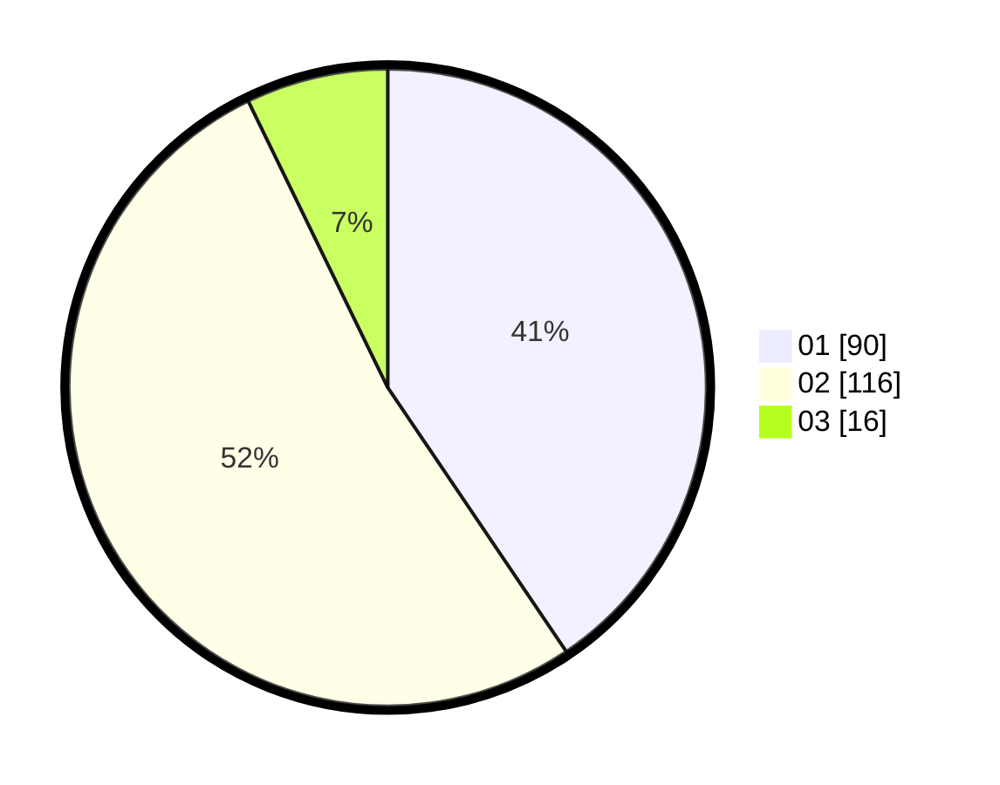

# Hasil

Hasil perolehan suara paslon dapat dilihat pada file paslon-01.txt, paslon-02.txt, dan paslon-03.txt.

Jika tidak ada, artinya data tersebut belum ada pada SIREKAP.

## Perolehan Suara

 * Paslon 01: **90**.
 * Paslon 02: **116**.
 * Paslon 03: **16**.

## Foto C Plano

https://sirekap-obj-formc.kpu.go.id/7508/pemilu/ppwp/31/75/08/10/02/3175081002038-20240216-010810--8b63b37f-bc3e-47b0-b676-6028eb1b9bb3.jpg

https://sirekap-obj-formc.kpu.go.id/7508/pemilu/ppwp/31/75/08/10/02/3175081002038-20240216-010826--5f432135-e90b-4c50-bf8e-aafee133b3ed.jpg

https://sirekap-obj-formc.kpu.go.id/7508/pemilu/ppwp/31/75/08/10/02/3175081002038-20240216-011848--10ba81c4-d25b-4805-978f-08abb659a43c.jpg

## DATA PEMILIH TETAP

Jumlah pemilih dalam DPT: **283**.
 * L: **147**.
 * P: **136**.

## DATA PENGGUNA HAK PILIH

Jumlah pengguna hak pilih dalam DPT: **212**.
 * L: **102**.
 * P: **110**.

Jumlah pengguna hak pilih dalam DPTb: **6**.
 * L: **3**.
 * P: **3**.

Jumlah pengguna hak pilih dalam DPK: **10**.
 * L: **7**.
 * P: **3**.

Jumlah pengguna hak pilih: **228**.
 * L: **112**.
 * P: **116**.

## JUMLAH SUARA SAH DAN TIDAK SAH

JUMLAH SELURUH SUARA SAH: **222**.

JUMLAH SUARA TIDAK SAH: **6**.

JUMLAH SELURUH SUARA SAH DAN SUARA TIDAK SAH: **228**.
