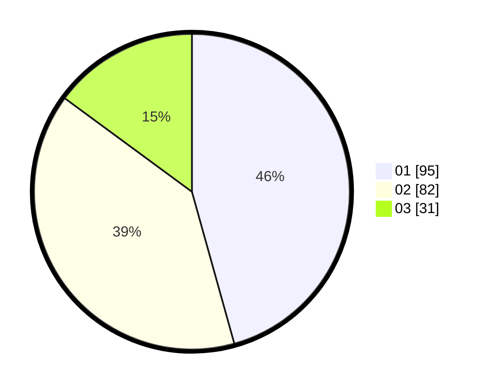

# Hasil

Hasil perolehan suara paslon dapat dilihat pada file paslon-01.txt, paslon-02.txt, dan paslon-03.txt.

Jika tidak ada, artinya data tersebut belum ada pada SIREKAP.

## Perolehan Suara

 * Paslon 01: **95**.
 * Paslon 02: **82**.
 * Paslon 03: **31**.

## Foto C Plano

https://sirekap-obj-formc.kpu.go.id/e871/pemilu/ppwp/31/75/08/10/02/3175081002043-20240216-142942--6a9a6ca8-4500-4a0f-a16a-b4d844cd6a9d.jpg

https://sirekap-obj-formc.kpu.go.id/e871/pemilu/ppwp/31/75/08/10/02/3175081002043-20240216-142943--6b90255b-ad68-4f32-aed5-25c71cb47c1d.jpg

https://sirekap-obj-formc.kpu.go.id/e871/pemilu/ppwp/31/75/08/10/02/3175081002043-20240216-142942--26a67779-a830-40f0-8f27-efce52eb01cf.jpg

## DATA PEMILIH TETAP

Jumlah pemilih dalam DPT: **265**.
 * L: **136**.
 * P: **129**.

## DATA PENGGUNA HAK PILIH

Jumlah pengguna hak pilih dalam DPT: **207**.
 * L: **103**.
 * P: **104**.

Jumlah pengguna hak pilih dalam DPTb: **1**.
 * L: **1**.
 * P: **0**.

Jumlah pengguna hak pilih dalam DPK: **1**.
 * L: **0**.
 * P: **1**.

Jumlah pengguna hak pilih: **209**.
 * L: **104**.
 * P: **105**.

## JUMLAH SUARA SAH DAN TIDAK SAH

JUMLAH SELURUH SUARA SAH: **208**.

JUMLAH SUARA TIDAK SAH: **1**.

JUMLAH SELURUH SUARA SAH DAN SUARA TIDAK SAH: **209**.
