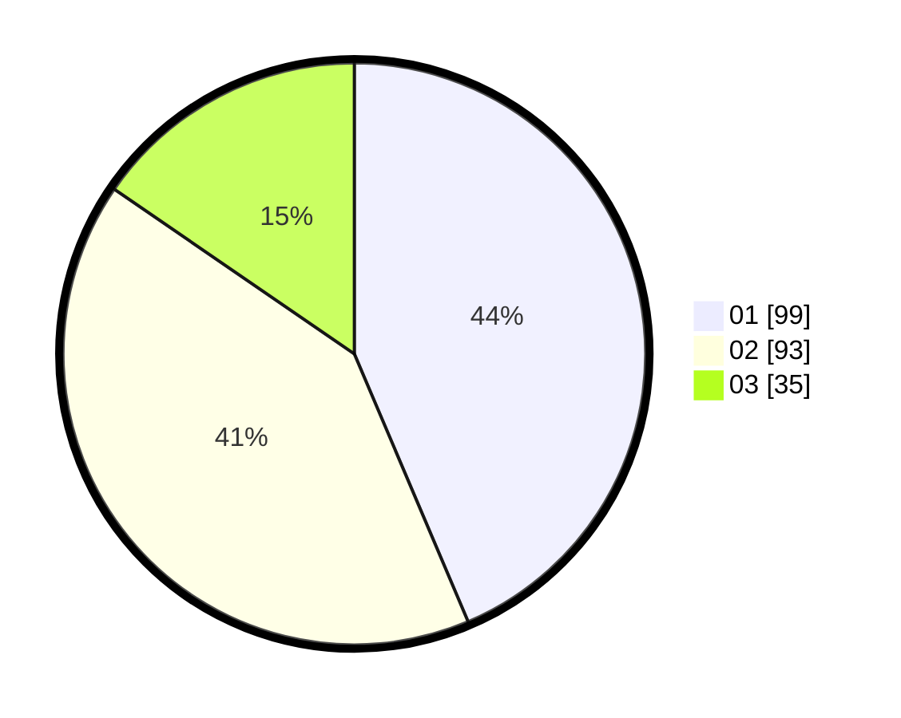

# Hasil

Hasil perolehan suara paslon dapat dilihat pada file paslon-01.txt, paslon-02.txt, dan paslon-03.txt.

Jika tidak ada, artinya data tersebut belum ada pada SIREKAP.

## Perolehan Suara

 * Paslon 01: **99**.
 * Paslon 02: **93**.
 * Paslon 03: **35**.

## Foto C Plano

https://sirekap-obj-formc.kpu.go.id/27f0/pemilu/ppwp/31/75/08/10/02/3175081002046-20240214-230506--e64c8f4c-01f5-4adf-8241-b5cc45e878ea.jpg

https://sirekap-obj-formc.kpu.go.id/27f0/pemilu/ppwp/31/75/08/10/02/3175081002046-20240214-230600--f5ba497d-3906-4a21-9083-79222f405e97.jpg

https://sirekap-obj-formc.kpu.go.id/27f0/pemilu/ppwp/31/75/08/10/02/3175081002046-20240214-230629--3d865e67-66a5-4bf9-ab2e-df98d3651781.jpg
