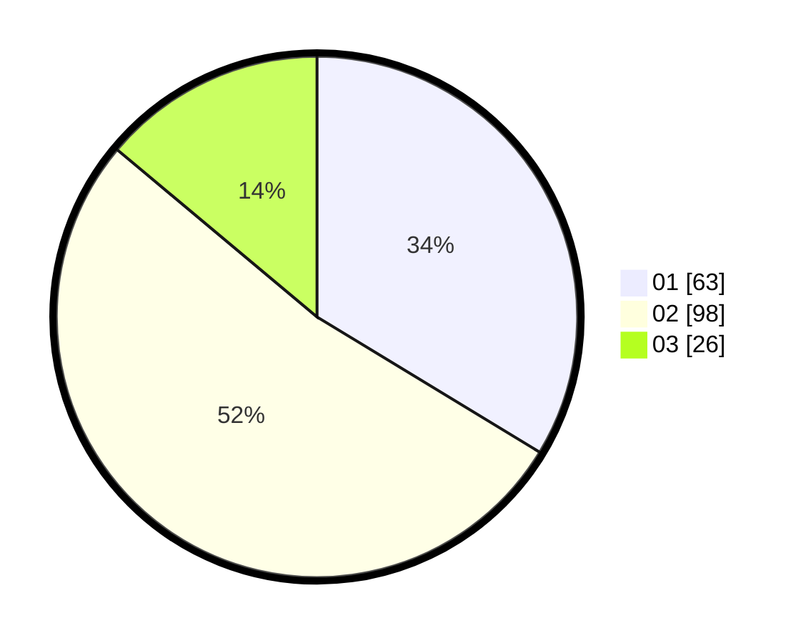

# Hasil

Hasil perolehan suara paslon dapat dilihat pada file paslon-01.txt, paslon-02.txt, dan paslon-03.txt.

Jika tidak ada, artinya data tersebut belum ada pada SIREKAP.

## Perolehan Suara

 * Paslon 01: **63**.
 * Paslon 02: **98**.
 * Paslon 03: **26**.

## Foto C Plano

https://sirekap-obj-formc.kpu.go.id/2cf2/pemilu/ppwp/31/75/08/10/02/3175081002050-20240214-195541--48e49287-16db-42c8-8007-9a162fd44bf8.jpg

https://sirekap-obj-formc.kpu.go.id/2cf2/pemilu/ppwp/31/75/08/10/02/3175081002050-20240214-195326--fded7566-48f4-41aa-a9ef-44d17fede7c7.jpg

https://sirekap-obj-formc.kpu.go.id/2cf2/pemilu/ppwp/31/75/08/10/02/3175081002050-20240214-195124--cfdb9dd2-54a2-4e8a-aacd-1d64e74138a6.jpg

## DATA PEMILIH TETAP

Jumlah pemilih dalam DPT: **264**.
 * L: **130**.
 * P: **134**.

## DATA PENGGUNA HAK PILIH

Jumlah pengguna hak pilih dalam DPT: **185**.
 * L: **93**.
 * P: **92**.

Jumlah pengguna hak pilih dalam DPTb: **2**.
 * L: **1**.
 * P: **1**.

Jumlah pengguna hak pilih dalam DPK: **0**.
 * L: **0**.
 * P: **0**.

Jumlah pengguna hak pilih: **187**.
 * L: **94**.
 * P: **93**.

## JUMLAH SUARA SAH DAN TIDAK SAH

JUMLAH SELURUH SUARA SAH: **187**.

JUMLAH SUARA TIDAK SAH: **0**.

JUMLAH SELURUH SUARA SAH DAN SUARA TIDAK SAH: **187**.
