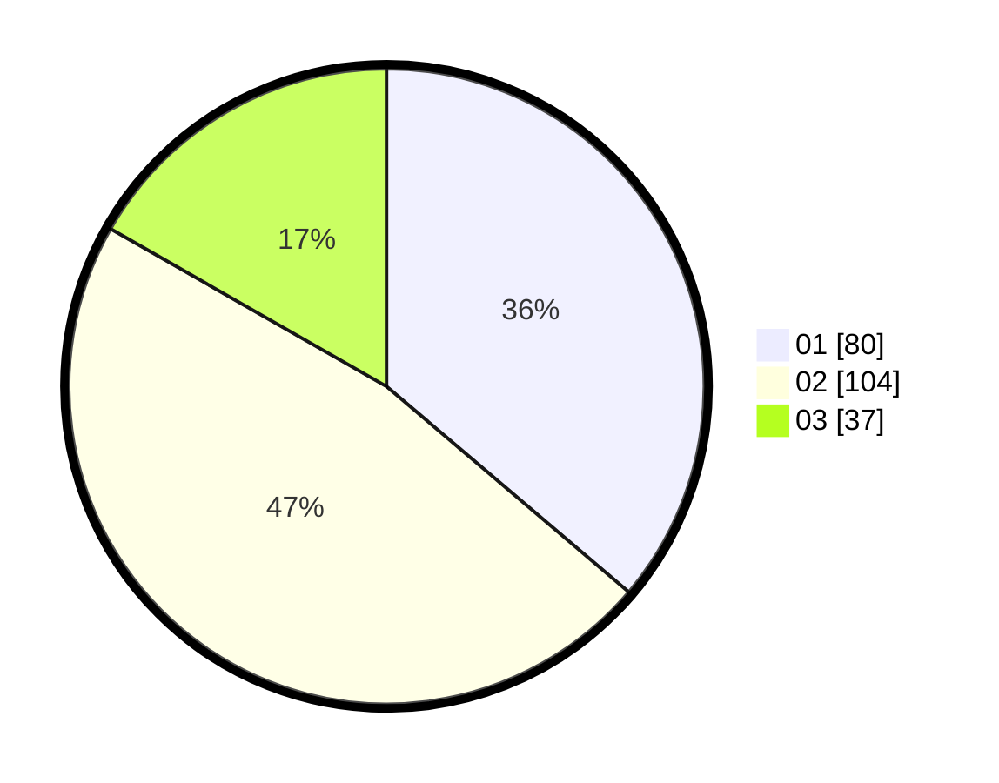

# Hasil

Hasil perolehan suara paslon dapat dilihat pada file paslon-01.txt, paslon-02.txt, dan paslon-03.txt.

Jika tidak ada, artinya data tersebut belum ada pada SIREKAP.

## Perolehan Suara

 * Paslon 01: **80**.
 * Paslon 02: **104**.
 * Paslon 03: **37**.

## Foto C Plano

https://sirekap-obj-formc.kpu.go.id/a246/pemilu/ppwp/31/75/08/10/02/3175081002051-20240214-215655--f71e3ca5-4fac-48b3-b209-d39efce57eec.jpg

https://sirekap-obj-formc.kpu.go.id/a246/pemilu/ppwp/31/75/08/10/02/3175081002051-20240214-180908--58f6013b-f53f-428f-b409-60592f7fc7df.jpg

https://sirekap-obj-formc.kpu.go.id/a246/pemilu/ppwp/31/75/08/10/02/3175081002051-20240214-215505--6d186746-7705-4061-8b65-f9da91e76435.jpg
