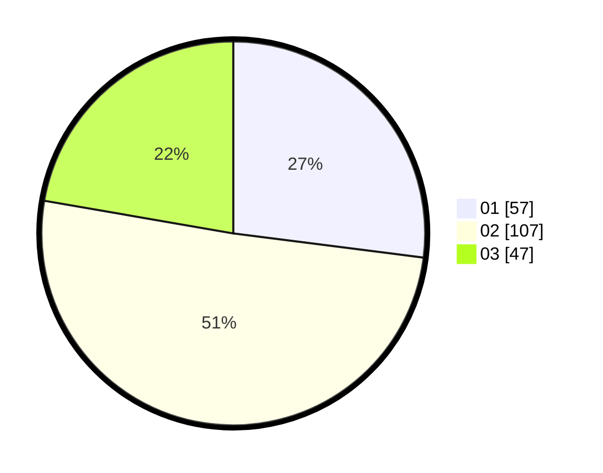

# Hasil

Hasil perolehan suara paslon dapat dilihat pada file paslon-01.txt, paslon-02.txt, dan paslon-03.txt.

Jika tidak ada, artinya data tersebut belum ada pada SIREKAP.

## Perolehan Suara

 * Paslon 01: **57**.
 * Paslon 02: **107**.
 * Paslon 03: **47**.

## Foto C Plano

https://sirekap-obj-formc.kpu.go.id/d7cb/pemilu/ppwp/31/75/08/10/02/3175081002055-20240215-012412--866b2e1e-b2a7-48f6-9895-39eea6dc4431.jpg

https://sirekap-obj-formc.kpu.go.id/d7cb/pemilu/ppwp/31/75/08/10/02/3175081002055-20240215-012602--d71cc856-fbb1-48d8-8414-79b90d2c68e9.jpg
