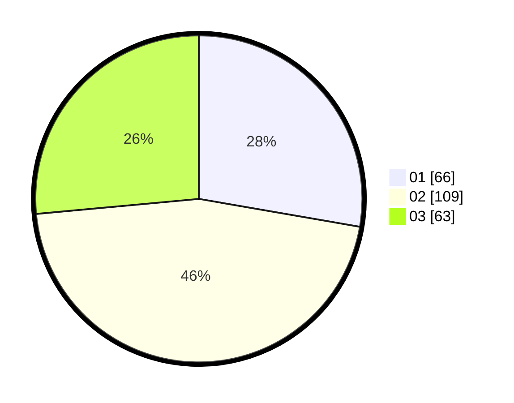

# Hasil

Hasil perolehan suara paslon dapat dilihat pada file paslon-01.txt, paslon-02.txt, dan paslon-03.txt.

Jika tidak ada, artinya data tersebut belum ada pada SIREKAP.

## Perolehan Suara

 * Paslon 01: **66**.
 * Paslon 02: **109**.
 * Paslon 03: **63**.

## Foto C Plano

https://sirekap-obj-formc.kpu.go.id/ebcf/pemilu/ppwp/31/75/08/10/02/3175081002057-20240216-210654--632c4713-22ba-4002-b6f0-d54bbaa48faf.jpg

https://sirekap-obj-formc.kpu.go.id/ebcf/pemilu/ppwp/31/75/08/10/02/3175081002057-20240216-210655--1f35b309-b6c3-435d-b328-6f9b49c4454c.jpg

https://sirekap-obj-formc.kpu.go.id/ebcf/pemilu/ppwp/31/75/08/10/02/3175081002057-20240216-210654--fe3f092d-6550-4f07-8ca1-5b185cfdcea2.jpg

## DATA PEMILIH TETAP

Jumlah pemilih dalam DPT: **268**.
 * L: **133**.
 * P: **135**.

## DATA PENGGUNA HAK PILIH

Jumlah pengguna hak pilih dalam DPT: **234**.
 * L: **113**.
 * P: **121**.

Jumlah pengguna hak pilih dalam DPTb: **0**.
 * L: **0**.
 * P: **0**.

Jumlah pengguna hak pilih dalam DPK: **9**.
 * L: **5**.
 * P: **4**.

Jumlah pengguna hak pilih: **243**.
 * L: **118**.
 * P: **125**.

## JUMLAH SUARA SAH DAN TIDAK SAH

JUMLAH SELURUH SUARA SAH: **238**.

JUMLAH SUARA TIDAK SAH: **5**.

JUMLAH SELURUH SUARA SAH DAN SUARA TIDAK SAH: **243**.
