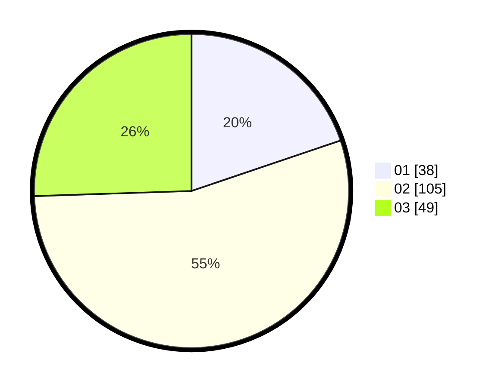

# Hasil

Hasil perolehan suara paslon dapat dilihat pada file paslon-01.txt, paslon-02.txt, dan paslon-03.txt.

Jika tidak ada, artinya data tersebut belum ada pada SIREKAP.

## Perolehan Suara

 * Paslon 01: **38**.
 * Paslon 02: **105**.
 * Paslon 03: **49**.

## Foto C Plano

https://sirekap-obj-formc.kpu.go.id/223e/pemilu/ppwp/31/75/08/10/02/3175081002058-20240215-135458--83a31f20-1317-474a-9f64-656a3f258517.jpg

https://sirekap-obj-formc.kpu.go.id/223e/pemilu/ppwp/31/75/08/10/02/3175081002058-20240215-135629--288874da-24bd-4544-8821-83dac54ded47.jpg

https://sirekap-obj-formc.kpu.go.id/223e/pemilu/ppwp/31/75/08/10/02/3175081002058-20240215-135834--db54cc4e-acc6-4c19-8154-f806705ba31d.jpg
