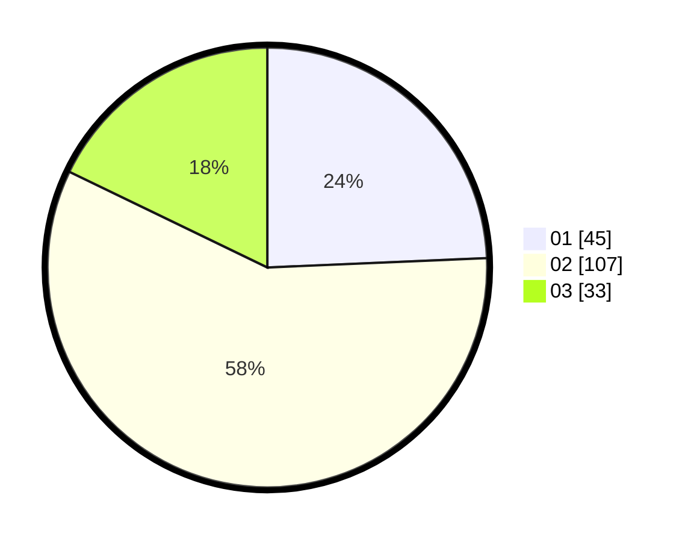

# Hasil

Hasil perolehan suara paslon dapat dilihat pada file paslon-01.txt, paslon-02.txt, dan paslon-03.txt.

Jika tidak ada, artinya data tersebut belum ada pada SIREKAP.

## Perolehan Suara

 * Paslon 01: **45**.
 * Paslon 02: **107**.
 * Paslon 03: **33**.

## Foto C Plano

https://sirekap-obj-formc.kpu.go.id/b94d/pemilu/ppwp/31/75/08/10/02/3175081002059-20240214-223924--71d50e5d-6d92-40a5-aeab-2888ade2eb77.jpg

https://sirekap-obj-formc.kpu.go.id/b94d/pemilu/ppwp/31/75/08/10/02/3175081002059-20240214-223314--bbb4fe62-8d1b-4042-96b2-04e61ae54517.jpg

https://sirekap-obj-formc.kpu.go.id/b94d/pemilu/ppwp/31/75/08/10/02/3175081002059-20240214-224255--fd67d338-b4ba-4733-905b-bbcd710b07ea.jpg
