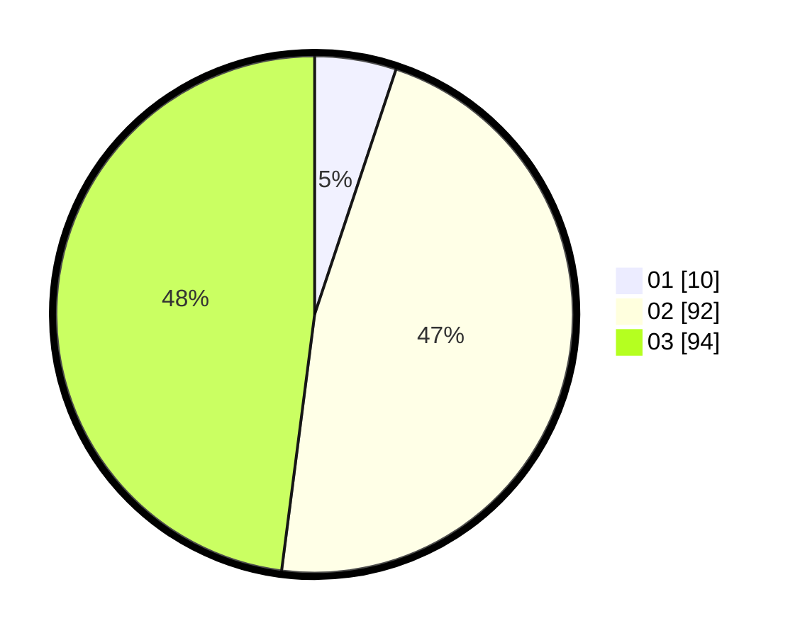

# Hasil

Hasil perolehan suara paslon dapat dilihat pada file paslon-01.txt, paslon-02.txt, dan paslon-03.txt.

Jika tidak ada, artinya data tersebut belum ada pada SIREKAP.

## Perolehan Suara

 * Paslon 01: **10**.
 * Paslon 02: **92**.
 * Paslon 03: **94**.

## Foto C Plano

https://sirekap-obj-formc.kpu.go.id/7758/pemilu/ppwp/31/75/08/10/02/3175081002062-20240214-162240--5025aab0-f7df-402e-81bf-6f4beef2a78d.jpg

https://sirekap-obj-formc.kpu.go.id/7758/pemilu/ppwp/31/75/08/10/02/3175081002062-20240214-155122--657fdc29-4aba-49d1-862d-6e6e4c37dab1.jpg

https://sirekap-obj-formc.kpu.go.id/7758/pemilu/ppwp/31/75/08/10/02/3175081002062-20240214-155128--421ae1e6-955c-4421-84d1-0f2b49e557d9.jpg

## DATA PEMILIH TETAP

Jumlah pemilih dalam DPT: **259**.
 * L: **124**.
 * P: **135**.

## DATA PENGGUNA HAK PILIH

Jumlah pengguna hak pilih dalam DPT: **199**.
 * L: **90**.
 * P: **109**.

Jumlah pengguna hak pilih dalam DPTb: **6**.
 * L: **4**.
 * P: **2**.

Jumlah pengguna hak pilih dalam DPK: **4**.
 * L: **2**.
 * P: **2**.

Jumlah pengguna hak pilih: **209**.
 * L: **96**.
 * P: **113**.

## JUMLAH SUARA SAH DAN TIDAK SAH

JUMLAH SELURUH SUARA SAH: **196**.

JUMLAH SUARA TIDAK SAH: **15**.

JUMLAH SELURUH SUARA SAH DAN SUARA TIDAK SAH: **211**.
