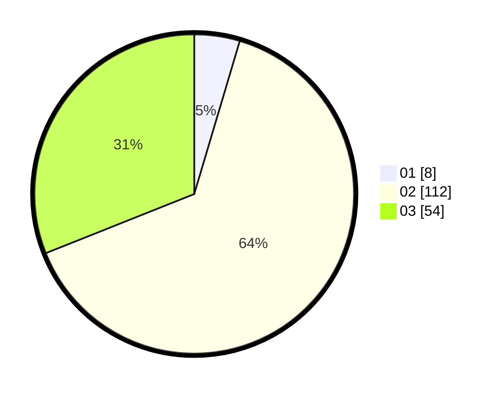

# Hasil

Hasil perolehan suara paslon dapat dilihat pada file paslon-01.txt, paslon-02.txt, dan paslon-03.txt.

Jika tidak ada, artinya data tersebut belum ada pada SIREKAP.

## Perolehan Suara

 * Paslon 01: **8**.
 * Paslon 02: **112**.
 * Paslon 03: **54**.

## Foto C Plano

https://sirekap-obj-formc.kpu.go.id/473b/pemilu/ppwp/31/75/08/10/02/3175081002063-20240215-004613--cc71b927-24ea-4e15-89f7-8dd6a4799001.jpg

https://sirekap-obj-formc.kpu.go.id/473b/pemilu/ppwp/31/75/08/10/02/3175081002063-20240215-003514--427ca707-09ab-48b6-8dcb-f9449eef19f8.jpg

https://sirekap-obj-formc.kpu.go.id/473b/pemilu/ppwp/31/75/08/10/02/3175081002063-20240215-003354--aed037bc-e5fd-44c9-b2d2-df7f038a6241.jpg
