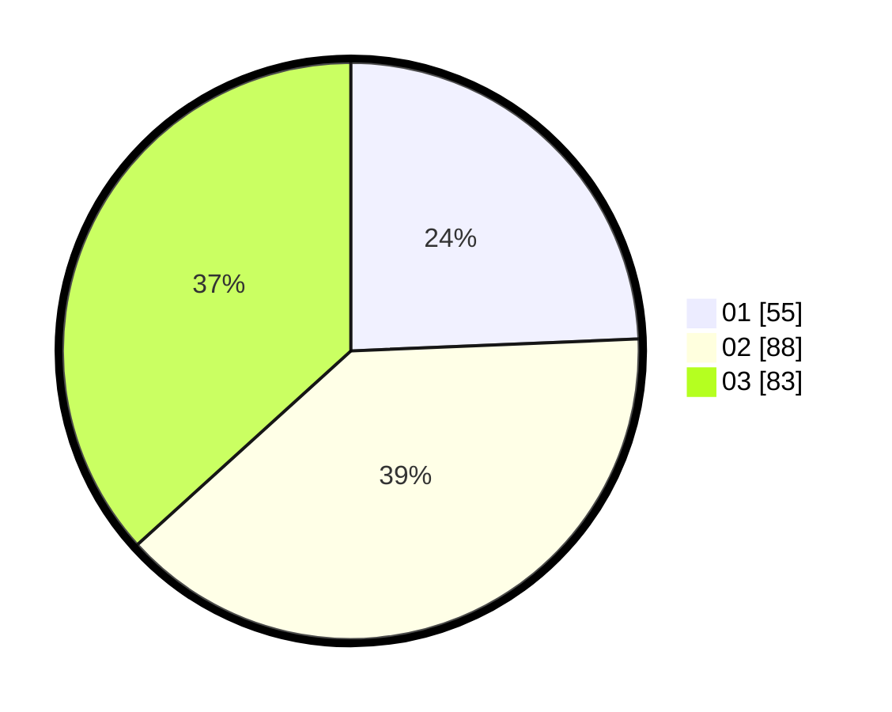

# Hasil

Hasil perolehan suara paslon dapat dilihat pada file paslon-01.txt, paslon-02.txt, dan paslon-03.txt.

Jika tidak ada, artinya data tersebut belum ada pada SIREKAP.

## Perolehan Suara

 * Paslon 01: **55**.
 * Paslon 02: **88**.
 * Paslon 03: **83**.

## Foto C Plano

https://sirekap-obj-formc.kpu.go.id/a592/pemilu/ppwp/31/75/08/10/02/3175081002067-20240215-031909--68fe30cb-ce6e-407b-8697-cf9006ca4706.jpg

https://sirekap-obj-formc.kpu.go.id/a592/pemilu/ppwp/31/75/08/10/02/3175081002067-20240215-031916--d56fe0e3-714e-4046-88bd-86dea1f65e47.jpg

https://sirekap-obj-formc.kpu.go.id/a592/pemilu/ppwp/31/75/08/10/02/3175081002067-20240215-031923--47f0cef3-2c84-4977-a4f0-25f6aa0d596d.jpg
