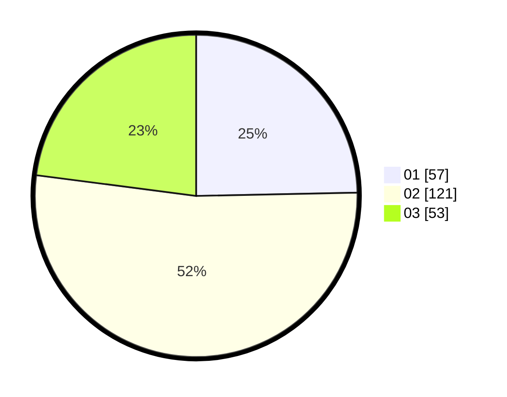

# Hasil

Hasil perolehan suara paslon dapat dilihat pada file paslon-01.txt, paslon-02.txt, dan paslon-03.txt.

Jika tidak ada, artinya data tersebut belum ada pada SIREKAP.

## Perolehan Suara

 * Paslon 01: **57**.
 * Paslon 02: **121**.
 * Paslon 03: **53**.

## Foto C Plano

https://sirekap-obj-formc.kpu.go.id/63cb/pemilu/ppwp/31/75/08/10/02/3175081002068-20240215-162311--d3915625-7d11-4558-9080-3d5c61204297.jpg

https://sirekap-obj-formc.kpu.go.id/63cb/pemilu/ppwp/31/75/08/10/02/3175081002068-20240215-162330--367f7ed5-8837-410e-a3d4-afdce743adfd.jpg

https://sirekap-obj-formc.kpu.go.id/63cb/pemilu/ppwp/31/75/08/10/02/3175081002068-20240215-162351--ddd2e88b-54a1-419f-8a70-de99bb66199b.jpg
