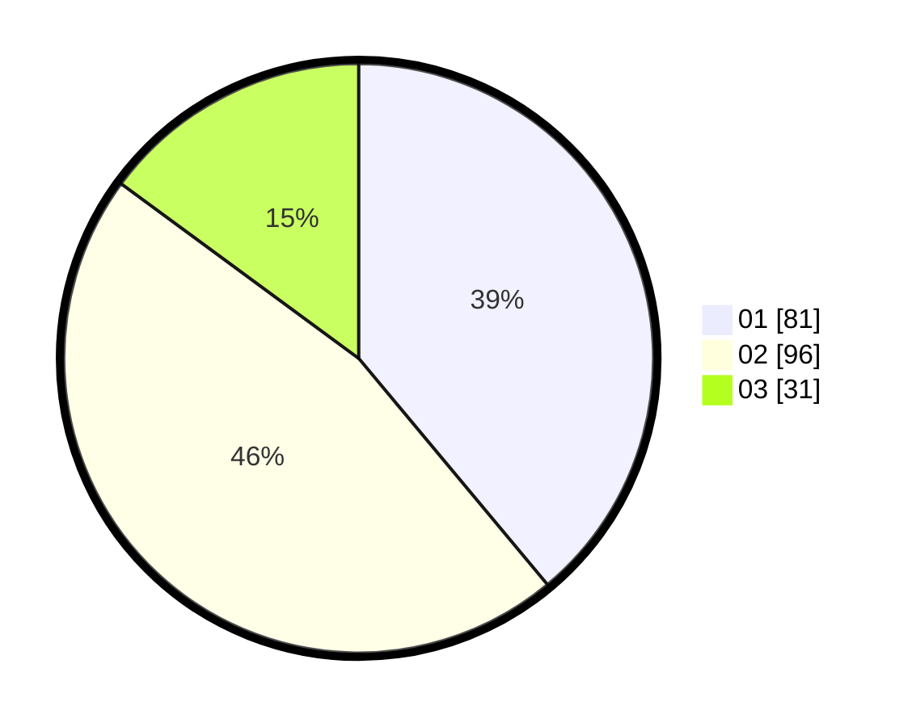

# Hasil

Hasil perolehan suara paslon dapat dilihat pada file paslon-01.txt, paslon-02.txt, dan paslon-03.txt.

Jika tidak ada, artinya data tersebut belum ada pada SIREKAP.

## Perolehan Suara

 * Paslon 01: **81**.
 * Paslon 02: **96**.
 * Paslon 03: **31**.

## Foto C Plano

https://sirekap-obj-formc.kpu.go.id/8098/pemilu/ppwp/31/75/08/10/02/3175081002070-20240214-204138--fc00c450-8735-4172-ad91-9e85cfd306c6.jpg

https://sirekap-obj-formc.kpu.go.id/8098/pemilu/ppwp/31/75/08/10/02/3175081002070-20240214-155337--50d07f9b-58f4-41e9-ae1d-3f2f3144f737.jpg

https://sirekap-obj-formc.kpu.go.id/8098/pemilu/ppwp/31/75/08/10/02/3175081002070-20240214-193340--72e40b69-b04c-4c06-bea3-76bec778b393.jpg

## DATA PEMILIH TETAP

Jumlah pemilih dalam DPT: **265**.
 * L: **120**.
 * P: **145**.

## DATA PENGGUNA HAK PILIH

Jumlah pengguna hak pilih dalam DPT: **205**.
 * L: **91**.
 * P: **114**.

Jumlah pengguna hak pilih dalam DPTb: **2**.
 * L: **0**.
 * P: **2**.

Jumlah pengguna hak pilih dalam DPK: **2**.
 * L: **0**.
 * P: **2**.

Jumlah pengguna hak pilih: **209**.
 * L: **91**.
 * P: **118**.

## JUMLAH SUARA SAH DAN TIDAK SAH

JUMLAH SELURUH SUARA SAH: **208**.

JUMLAH SUARA TIDAK SAH: **1**.

JUMLAH SELURUH SUARA SAH DAN SUARA TIDAK SAH: **209**.
